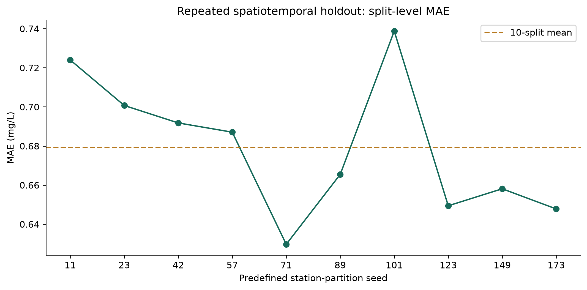

# WaterSense AI

**Evaluating Spatial and Temporal Generalization in Machine-Learning-Based Dissolved Oxygen Prediction**

WaterSense AI is a reproducible machine-learning study of dissolved oxygen (DO) prediction from routine river-water chemistry. It tests whether conclusions survive station, time and river-basin separation, repeated spatiotemporal splits, alternative feature sets and fixed model families. A Streamlit deployment makes the completed research and its limitations accessible.

**Research snapshot:** 151,031 modelling observations · 840 monitoring stations · 1990–2024 · station-grouped 5-fold CV · exactly 10 predefined spatiotemporal splits · checksum-verified v1.0 and v2.0 outputs.

**Key takeaway:** repeated spatiotemporal MAE was **0.6793 ± 0.0353 mg/L**, but rare observations below 4 mg/L had per-split MAE of **2.8846–4.7678 mg/L** and were overpredicted in almost every case.

[v2.0 robustness report](research_outputs_v2/reports/RESEARCH_RESULTS_V2.md) · [v1.0 report](research_outputs/reports/RESEARCH_RESULTS.md) · [Experiment protocol](docs/research_protocol.md)

## Research Question

> How well can machine-learning models predict dissolved oxygen and generalize across unseen monitoring stations and future time periods?

Secondary question: **Where does the model fail, even when aggregate metrics appear acceptable?**

## Dataset

NIEA/DAERA **River Water Quality Monitoring 1990–2024 — All Parameters**, published through OpenDataNI.

| Recomputed property | Value |
|---|---:|
| Raw observations / columns | 178,680 / 40 |
| Raw monitoring stations | 1,311 |
| Modelling observations / stations | 151,031 / 840 |
| Modelling dates | 1990-01-02 to 2024-12-11 |
| Target | Original measured dissolved oxygen, mg/L |

The target is measured `DO_mg_l_`, renamed to `dissolved_oxygen_mg_l`; missing or qualified targets are excluded. Inputs cover routine chemistry, censor flags and cyclical sampling-date features. No Safe/Unsafe labels are created.

Contains public sector information licensed under the [UK Open Government Licence v3.0](https://www.nationalarchives.gov.uk/doc/open-government-licence/version/3/). See [source, download, provenance and cleaning details](docs/dataset.md). Raw/full processed data remain ignored; public derived artifacts retain source attribution.

## Validation Design

Each split answers a different generalization question; its metrics are not interchangeable measures of model quality.

| Setting | What it tests | Train / test observations | Train / test stations | Station overlap |
|---|---|---:|---:|---:|
| Random Rows | Interpolation-like performance; known stations can occur on both sides | 120,824 / 30,207 | 833 / 813 | 806 |
| Unseen Stations | Transfer to monitoring locations absent from training | 119,690 / 31,341 | 672 / 168 | 0 |
| Future Years | Later observations, often at previously observed stations | 132,766 / 9,676 | 832 / 508 | 500 |
| Spatiotemporal Holdout | Later observations at stations completely excluded from training | 120,955 / 1,828 | 733 / 101 | 0 |

Future Years trains on 1990–2018, reserves 2019–2021 for interval calibration and tests on 2022–2024. Spatiotemporal holdout trains on 1990–2021 and tests on 2022–2024 at continuing stations completely excluded from training; seed 42 is the v1.0 partition.

All settings reuse the fixed Random Forest and fit preprocessing only on training data. The [protocol](docs/research_protocol.md) documents settings, exclusions and split memberships.

v2.0 repeats the spatiotemporal design for the 10 predefined seeds `11, 23, 42, 57, 71, 89, 101, 123, 149, 173`; no seed is selected as best. It also uses existing `PrimaryBasin` metadata for one stricter hydrological split: 48 training and 12 test basins, with zero basin or station overlap. Six modelling stations without basin metadata are excluded from that analysis.

Chemistry is measured at prediction time, so these are contemporaneous estimates rather than forecasts with unknown future inputs. Model and feature choices were selected retrospectively from earlier grouped experiments; v2.0 is a robustness analysis, not fresh prospective validation.

## v2.0 Repeated Spatiotemporal Results

Each split trains on 1990–2021 and tests on 2022–2024 at 101 stations entirely absent from training. Summary values describe 10 splits, not confidence intervals.

| Metric | Mean | SD | Median | IQR | Min | Max |
|---|---:|---:|---:|---:|---:|---:|
| MAE (mg/L) | 0.6793 | 0.0353 | 0.6763 | 0.0469 | 0.6297 | 0.7388 |
| RMSE (mg/L) | 0.9560 | 0.0680 | 0.9490 | 0.1102 | 0.8475 | 1.0581 |
| R² | 0.6558 | 0.0182 | 0.6544 | 0.0113 | 0.6312 | 0.6903 |

Seed 42 exactly reproduces the v1.0 spatiotemporal MAE of 0.6918 mg/L. The river-basin holdout was harder: MAE 1.0792 mg/L, RMSE 1.8031 mg/L and R² 0.4122. Its test population differs, so this is descriptive evidence rather than a causal estimate of the effect of basin separation.



## Key Finding — Low-Oxygen Reliability

Overall MAE below 1 mg/L did not imply uniform reliability across conditions.

Across the 10 spatiotemporal splits, the below-4 mg/L subgroup contained only **3–21 observations per split**. Its per-split MAE was **2.8846–4.7678 mg/L** (mean 3.8616), and **9 of 10 splits overpredicted every low-DO observation**; the remaining split overpredicted 90.9%. This is a persistent warning signal, not proof of universal systematic bias, because subgroup counts are small and observations repeat across splits.

All five fixed model families also showed large low-DO errors where subgroup size was sufficient. The concentration ranges are descriptive, not regulatory or safety categories.

## Feature Ablation

Core chemistry supplies a predictive baseline. Adding date-derived features produced the largest observed gain; missingness and censoring indicators added smaller gains, and the full existing feature set ranked best.

| Feature set | Group-CV MAE ± fold SD (mg/L) |
|---|---:|
| Core | 1.2097 ± 0.0379 |
| Core + Date | 0.9502 ± 0.0384 |
| Core + Date + Missingness | 0.9462 ± 0.0393 |
| Core + Date + Missingness + Censoring | 0.9405 ± 0.0378 |
| Full | 0.8798 ± 0.0353 |

The five cumulative configurations use identical grouped folds and fixed Random Forest settings. This is a predictive comparison, not a full factorial or causal analysis. Full results are in the [v2.0 report](research_outputs_v2/reports/RESEARCH_RESULTS_V2.md).

## Uncertainty / Reliability

Separate calibration residuals define approximate **90% prediction intervals**:

| Calibration experiment | Overall empirical coverage | Coverage below 4 mg/L | Low-DO n | Mean interval width |
|---|---:|---:|---:|---:|
| Reserved training stations | 91.72% | 25.75% | 167 | 4.017 mg/L |
| 2019–2021 → 2022–2024 | 89.30% | 18.57% | 70 | 2.702 mg/L |
| Repeated spatiotemporal, mean across splits | 95.13% | 8.27% | 3–21 per split | 3.810 mg/L |

Aggregate coverage was near or above nominal, but much worse for low-DO observations. These are empirical prediction intervals for separately fitted research models, not measurement confidence intervals or guarantees. Spatial and temporal shift may violate exchangeability assumptions.

## Feature Importance

Across the five station-grouped folds, permutation importance ranked cyclical day-of-year cosine first in every fold, followed by pH, day-of-year sine and alkalinity. Mean pairwise Spearman rank correlation was **0.9485** (range 0.9236–0.9742), although lower-ranked features varied more. The analysis separates within-fold permutation randomness from across-fold variation.

**Predictive importance reflects association, not causation.** Correlated inputs may substitute for one another. See the [v2.0 importance table](research_outputs_v2/tables/importance_stability.csv).

## Fixed Model-Family Check

Under station-grouped CV, mean MAE was 1.4305 for Dummy, 1.0375 for Ridge, 0.8798 for Random Forest, 0.8551 for Extra Trees and 0.9416 mg/L for HistGradientBoosting. The nonlinear models also performed similarly on the temporal and seed-42 spatiotemporal checks. This supports the broad validation conclusions but does not justify replacing the deployed estimator; no tuning or production-model selection was performed.

## Limitations

- Observational data and predictive importance do not establish causation.
- Geographic evidence is limited to the Northern Ireland monitoring network. `PrimaryBasin` separation is stricter than station separation, but it is still one deterministic basin split rather than external-region validation.
- Water temperature, flow/discharge and catchment characteristics are absent from the current predictors.
- Low-oxygen observations are rare: repeated spatiotemporal splits contain only 3–21 below-4 mg/L observations each, and repeated test observations are not independent.
- Test composition, unequal sampling and training horizons affect aggregate metrics.
- Historical monitoring practice and environmental relationships may change over time.
- Prediction-interval calibration is distribution-dependent; overall coverage hides subgroup weaknesses.
- Continuing-station eligibility creates selection effects; repeated splits quantify partition sensitivity but do not create ten independent datasets.
- Prior all-year model selection and repeated inspection limit prospective interpretation.
- Predictions and intervals do not replace field measurements or laboratory analysis.

## Interactive Demo

The existing Streamlit application explores the data, model behavior, v1.0 validation and individual predictions. v2.0 does not change the app or the deployed estimator. See [deployment instructions](docs/deployment.md).

## Reproducibility

From the repository root, install dependencies and obtain the raw export documented in [dataset.md](docs/dataset.md):

```bash
python -m venv .venv
source .venv/bin/activate
python -m pip install -r requirements.txt
git lfs pull
```

Run the completed workflows into new output directories:

```bash
python scripts/run_research_v2.py --output research_outputs_v2
python scripts/run_research_experiments.py --experiment all --output research_runs/reproduction
python -m unittest discover -s tests -v
streamlit run app/app.py
```

The v2 command refuses to overwrite a non-empty output directory; use a different empty directory for a repeat run. It verifies v1.0 checksums before and after execution, reuses the existing data preparation and split logic, and does not change the production model.

Fixed seeds, settings, source/data/output hashes and package versions are recorded in the [v2.0 manifest](research_outputs_v2/manifests/v2_manifest.json). Original data, models and v1.0 results are protected by checksums. Partial runs belong under ignored `research_runs/`.

## Repository Structure

```text
src/                Preprocessing, modelling, evaluation and research reporting
scripts/            Reproducible experiment entry points
research_outputs/   Verified tables, figures, predictions, reports and manifest
research_outputs_v2/ Scoped v2.0 robustness tables, figures, predictions and manifest
app/                Streamlit research interface and saved-model estimator
docs/               Dataset, protocol, limitations and application materials
tests/              Pipeline, application and research-contract tests
models/             Saved historical/deployed models (Git LFS where configured)
```

Historical reports and notebooks remain development records; current robustness evidence is in the v2.0 report.

## Transparency

WaterSense AI is an educational research prototype. AI-assisted implementation and the author's research direction are documented in the project records. Application materials should describe contributions and learning honestly, without implying regulatory readiness or independent implementation where assistance was used.
