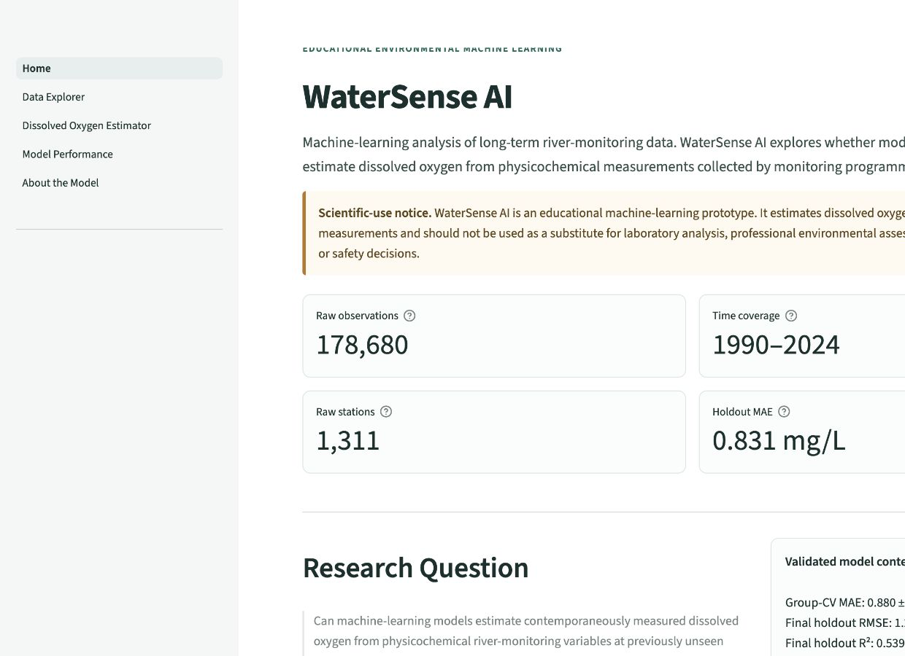
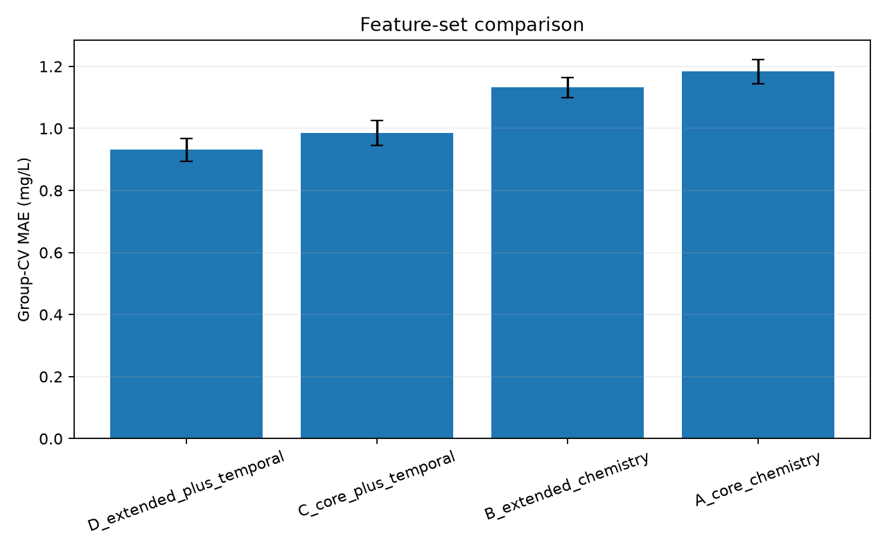
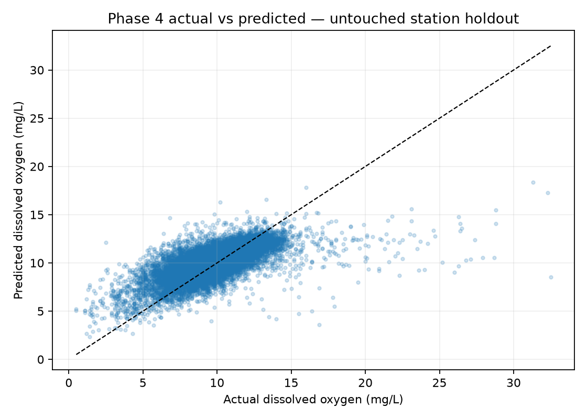
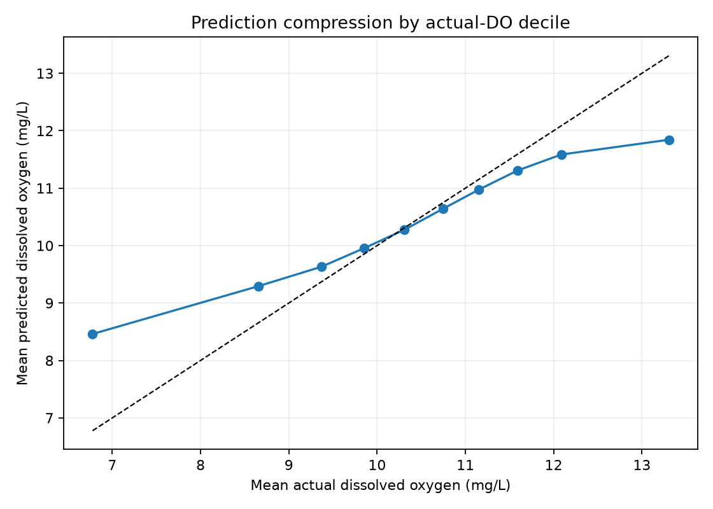
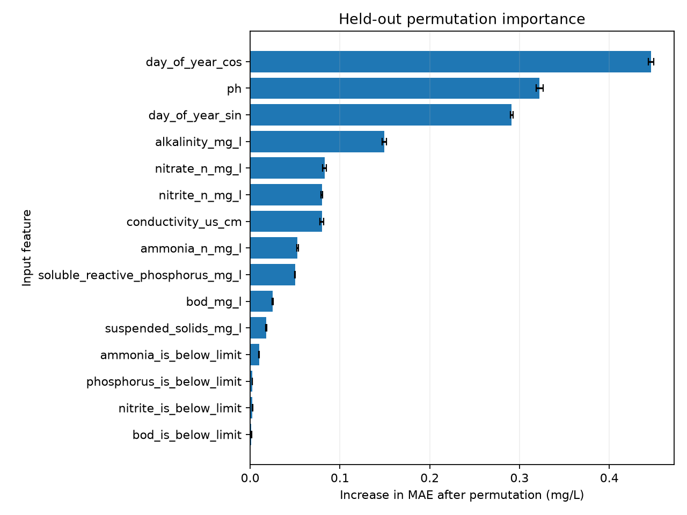

# WaterSense AI



## Overview

WaterSense AI is an educational machine-learning study estimating **contemporaneously measured dissolved oxygen** from long-term river-monitoring chemistry data. The project focuses on reproducible preprocessing, leakage-aware validation, honest error analysis and careful scientific language.

> **Headline result:** the selected Random Forest achieved **0.831 mg/L MAE** on a station-grouped holdout containing 31,341 observations from 168 monitoring stations absent from training.

This is not a water-safety classifier, future pollution forecast, regulatory decision system or official ecological-status assessment.

## Research question

> Can machine-learning models estimate contemporaneously measured dissolved oxygen from physicochemical river-monitoring variables at previously unseen monitoring stations?

## Dataset

The project uses **River Water Quality Monitoring 1990 to 2024 — All Parameters**, published by the Northern Ireland Environment Agency (NIEA/DAERA) through OpenDataNI/data.gov.uk under the UK Open Government Licence.

- Raw observations: **178,680**
- Raw monitoring stations: **1,311**
- Eligible modelling observations: **151,031**
- Eligible modelling stations: **840**
- Observed dates: **1990-01-02 to 2024-12-11**
- Geographic scope: **Northern Ireland rivers**
- Continuous target: **dissolved oxygen (mg/L)**

The source, schema, licence and data limitations are documented in [`docs/dataset.md`](docs/dataset.md) and [`docs/data_quality_report.md`](docs/data_quality_report.md). Raw data are not committed to Git; the verified export checksum and official download location are recorded in the dataset documentation.

## Methodology

### Data preparation

- The raw CSV remains unchanged; processing writes a separate modelling table.
- Rows without dissolved oxygen and six `<`-qualified targets are excluded from supervised regression.
- Censored predictor values retain their exported numeric companion plus explicit below/above-limit flags.
- Half-limit substitution is not used.
- Missing predictors use median imputation and missingness indicators fitted only on training data.
- Station names, locations, coordinates, basin, identifiers, depth and raw date IDs are not model inputs.
- Statistical outliers remain unless an observation is verified as erroneous.

### Validation

Repeated measurements from one station are related, so random row splitting could produce optimistic results. The primary holdout is grouped by `StationCode`:

| Split | Rows | Stations |
|---|---:|---:|
| Training | 119,690 | 672 |
| Final test | 31,341 | 168 |

Station overlap is zero. Feature and parameter selection use five-fold `GroupKFold` only within the training stations. Preprocessing is refitted inside every fold, and the final test set remains excluded until model selection is complete.

### Feature development

Four predefined feature sets were compared:

| Feature set | Description | CV MAE |
|---|---|---:|
| A | Core chemistry and censor flags | 1.184 mg/L |
| B | Core plus alkalinity, conductivity and suspended solids | 1.132 mg/L |
| C | Core plus cyclical day-of-year context | 0.986 mg/L |
| D | Extended chemistry plus temporal context | 0.931 mg/L |

Temporal context added more predictive information than extended chemistry alone. This is a predictive association and does not show that season causes dissolved oxygen to change.

## Results

### Phase 3 baselines

| Model | MAE | RMSE | R² |
|---|---:|---:|---:|
| Random Forest | 1.181 | 1.644 | 0.253 |
| Linear Regression | 1.282 | 1.767 | 0.136 |
| Dummy Mean | 1.392 | 1.902 | approximately 0 |
| Decision Tree | 1.686 | 2.404 | -0.599 |

### Selected Phase 4 model

The selected model is a Random Forest with 150 trees, `min_samples_leaf=2`, `max_features=0.8` and `random_state=42`, using feature set D.

| Evaluation | MAE | RMSE | R² |
|---|---:|---:|---:|
| Five-fold station-grouped CV | 0.880 ± 0.035 | 1.392 | 0.510 |
| Untouched 168-station holdout | 0.831 | 1.291 | 0.539 |

Holdout MAE decreased by **0.350 mg/L (29.6%)** relative to the Phase 3 Random Forest. This combines feature refinement, temporal context and modest parameter tuning.

## Error analysis

Performance remains uneven across the target range:

| Actual-DO range | MAE | Directional finding |
|---|---:|---|
| Overall | 0.831 mg/L | Mean residual -0.030 mg/L |
| Lowest 10% | 1.812 mg/L | 89.964% overpredicted |
| Central 25–75% | 0.572 mg/L | Approximately balanced |
| Highest 10% | 1.396 mg/L | 94.831% underpredicted |

The model still compresses unusual observations toward the middle. This limitation is not visible from overall MAE alone.

## Figures

### Feature-set comparison



*Station-grouped CV MAE for the four predefined feature sets.*

### Untouched holdout predictions



*Actual and predicted dissolved oxygen for monitoring stations excluded from training.*

### Prediction compression



*Mean actual and predicted DO within actual-target deciles, showing weaker performance at the extremes.*

### Permutation importance



*Increase in held-out MAE when each input is disrupted. These are predictive associations, not causal effects.*

## Explainability and uncertainty

Held-out permutation importance ranked cyclical day-of-year context, pH and alkalinity highest. Partial dependence was used as a global model-behaviour visualisation. SHAP was deliberately not added because the global explanation objective was already satisfied and an additional compatibility-sensitive dependency was not justified.

Across five group-CV validation folds, absolute-error percentiles were 0.592 mg/L at the median, 1.117 at the 75th percentile, 1.908 at the 90th and 2.622 at the 95th. These are empirical validation-error summaries, not formal prediction intervals.

## Interactive application

The five-page Streamlit application provides:

- a concise project overview;
- responsive exploration based on exact aggregates and a reproducible sample of real records;
- a dissolved-oxygen estimator using the unchanged saved Phase 4 pipeline;
- validation, feature-set and error-analysis visualisations;
- scientific context, limitations and an accessible glossary.

The estimator supports missing measurements, reporting-limit qualifiers and sampling-date context. It never creates safety categories or retrains the model. See [`docs/application_data_contract.md`](docs/application_data_contract.md) for the exact 25-feature mapping.

## Repository structure

```text
WaterSense-AI/
├── app/                      # Five-page Streamlit application
├── assets/screenshots/       # Genuine local application captures
├── data/
│   ├── raw/                  # Original export; ignored by Git
│   ├── processed/            # Generated modelling data; ignored by Git
│   └── app/                  # Lightweight reproducible deployment artifacts
├── docs/                     # Dataset, methodology and research records
├── models/                   # Final model via Git LFS; other models ignored
├── notebooks/
│   ├── 01_data_exploration.ipynb
│   ├── 02_data_cleaning.ipynb
│   └── 03_model_training.ipynb
├── reports/                  # Academic and portfolio documentation
├── results/                  # Executed metrics, predictions and figures
├── scripts/                  # Reproducible public-app artifact builder
├── src/
│   ├── preprocessing.py
│   ├── train.py
│   ├── refine.py
│   ├── evaluate.py
│   └── predict.py
├── tests/
├── requirements.txt
└── LICENSE
```

## Reproduce the analysis

Run all commands from the repository root.

### 1. Create an environment and install dependencies

```bash
python -m venv .venv
source .venv/bin/activate
python -m pip install --upgrade pip
python -m pip install -r requirements.txt
```

On Windows, activate with `.venv\Scripts\activate`.

### 2. Obtain the raw data

Follow [`docs/dataset.md`](docs/dataset.md) and place the unchanged official export at:

```text
data/raw/niea_river_water_quality_1990_2024.csv
```

Verify that its SHA-256 matches the documented file before reproducing the recorded results.

### 3. Run exploratory analysis and preprocessing

Open and run the notebooks in order:

```bash
jupyter notebook notebooks/01_data_exploration.ipynb
jupyter notebook notebooks/02_data_cleaning.ipynb
```

The cleaning notebook generates `data/processed/water_quality_modeling.csv` without overwriting the raw export.

For non-interactive execution:

```bash
jupyter nbconvert --to notebook --execute notebooks/02_data_cleaning.ipynb \
  --output 02_data_cleaning.executed.ipynb
```

### 4. Reproduce Phase 3 baselines

```bash
python -m src.train \
  --data data/processed/water_quality_modeling.csv \
  --water-quality-baseline
```

### 5. Reproduce Phase 4 refinement and figures

```bash
python -m src.refine
```

This recreates group-CV results, feature comparisons, modest tuning results, final diagnostics, permutation importance, partial dependence and the saved Phase 4 pipeline.

### 6. Run tests

```bash
python -m unittest discover -s tests -v
```

The suite verifies group separation, final-test isolation, feature construction, finite preprocessing output, saved-model loading, prediction length and the application input contract.

## Run the Interactive App

The application requires the lightweight public app data and verified Phase 4 model artifact:

```text
data/app/
models/phase4_selected_model.joblib
```

After installing `requirements.txt`, start the local Streamlit server from the repository root:

```bash
streamlit run app/app.py
```

The interface loads the existing fitted pipeline and never retrains it. If an artifact is missing, the app displays the relevant reproduction command instead of silently creating a replacement. The exact input mapping is documented in [`docs/application_data_contract.md`](docs/application_data_contract.md).

For GitHub and Streamlit Community Cloud preparation, including Git LFS handling for the 176 MB verified model, see [`docs/deployment.md`](docs/deployment.md).

## Reports and documentation

- [Main academic report](reports/WaterSense_AI_Report.md)
- [Portfolio summary](reports/WaterSense_AI_Portfolio_Summary.md)
- [One-page summary](reports/WaterSense_AI_One_Page.md)
- [Model-refinement record](docs/model_refinement.md)
- [Low-DO case studies](docs/low_do_case_studies.md)
- [Current project status](docs/project_status.md)
- [Application data contract](docs/application_data_contract.md)
- [Deployment guide](docs/deployment.md)
- [Deployment checklist](docs/deployment_checklist.md)
- [Public-release audit](docs/release_audit.md)
- [Project timeline](docs/project_timeline.md)
- [Demo script](reports/demo_script.md)
- [Portfolio website copy](reports/portfolio_web_copy.md)

## Data source and licence

Dataset: **River Water Quality Monitoring 1990 to 2024 — All Parameters**, Northern Ireland Environment Agency / DAERA, published through OpenDataNI. Contains public sector information licensed under the [UK Open Government Licence v3.0](https://www.nationalarchives.gov.uk/doc/open-government-licence/version/3/).

The raw and processed datasets are not committed. The small files in `data/app/` are derived reproducibly for visualisation and input-context calculations; their source checksum and row counts are recorded in `data/app/manifest.json`.

## Limitations

- No water temperature, flow or equivalent physical context is available.
- Geographic coverage is limited to Northern Ireland rivers.
- The objective is contemporaneous estimation, not future forecasting.
- Monitoring methods or priorities may have changed across 35 years.
- Missingness, censored values and unverified extremes remain.
- Error is substantially higher at the lowest and highest DO values.
- Permutation importance and partial dependence do not establish causation.
- Empirical error percentiles are not formal prediction intervals.
- The model has no regulatory, safety or external geographic validation.

## Development transparency

AI-assisted coding tools were used during implementation and debugging. Project design, dataset selection, modelling decisions, validation strategy, interpretation and documentation were reviewed and directed by the project author.

## Disclaimer

> WaterSense AI is an educational research prototype. It must not replace professional environmental testing, regulatory assessment or domain-expert judgement.
