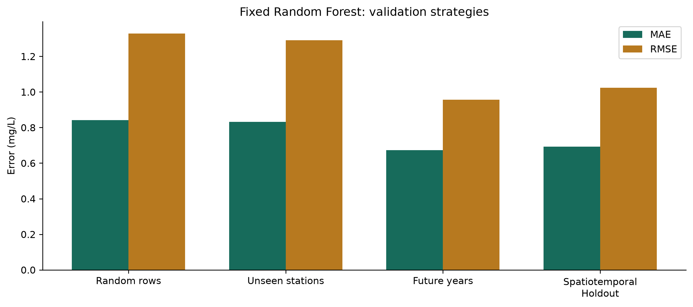
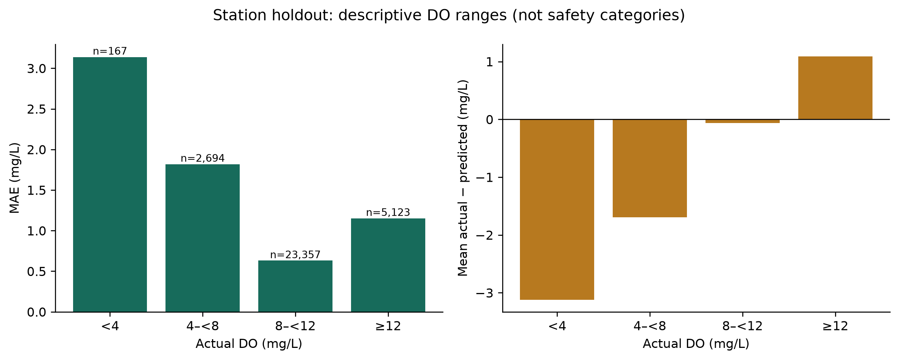
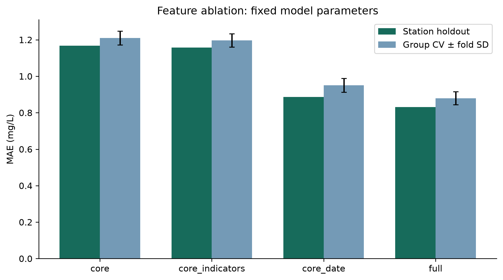
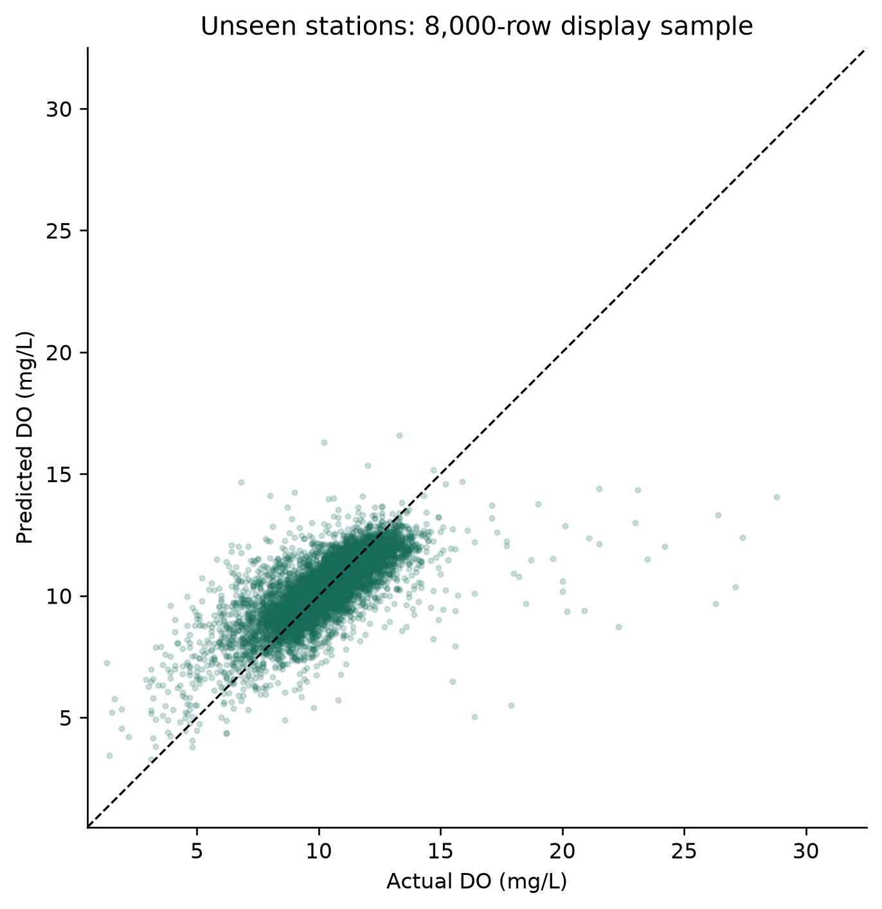

# WaterSense AI

**Evaluating Spatial and Temporal Generalization in Machine-Learning-Based Dissolved Oxygen Prediction**

WaterSense AI is a reproducible machine-learning study of dissolved oxygen (DO) prediction from routine river-water chemistry. It compares random, spatial, temporal and combined spatial-temporal evaluation, then investigates feature contributions, uncertainty and prediction failures. A Streamlit deployment makes the completed research and its limitations accessible.

**Research snapshot:** 151,031 modelling observations · 840 monitoring stations · 1990–2024 · station-grouped 5-fold CV · four holdout settings · fixed-seed, checksum-verified outputs.

**Key takeaway:** average errors below 1 mg/L concealed substantially poorer reliability on rare low-oxygen observations.

[Full research report](research_outputs/reports/RESEARCH_RESULTS.md) · [Experiment protocol](docs/research_protocol.md) · [Application materials](docs/application_materials.md)

## Research Question

> How well can machine-learning models predict dissolved oxygen and generalize across unseen monitoring stations and future time periods?

Secondary question: **Where does the model fail, even when aggregate metrics appear acceptable?**

## Dataset

NIEA/DAERA **River Water Quality Monitoring 1990–2024 — All Parameters**, published through OpenDataNI.

| Recomputed property | Value |
|---|---:|
| Raw observations / columns | 178,680 / 40 |
| Raw monitoring stations | 1,311 |
| Modelling observations / stations | 151,031 / 840 |
| Modelling dates | 1990-01-02 to 2024-12-11 |
| Target | Original measured dissolved oxygen, mg/L |

The target is renamed from `DO_mg_l_` to `dissolved_oxygen_mg_l`; missing or qualified targets are excluded. Inputs include pH, nutrients, oxygen-demand measures, solids, alkalinity and conductivity, alongside censor flags and cyclical sampling-date features. No Safe/Unsafe labels are created.

Contains public sector information licensed under the [UK Open Government Licence v3.0](https://www.nationalarchives.gov.uk/doc/open-government-licence/version/3/). See [source, download, provenance and cleaning details](docs/dataset.md). Raw/full processed data remain ignored; public derived artifacts retain source attribution.

## Validation Design

Each split answers a different generalization question; its metrics are not interchangeable measures of model quality.

| Setting | What it tests | Train / test observations | Train / test stations | Station overlap |
|---|---|---:|---:|---:|
| Random Rows | Interpolation-like performance; known stations can occur on both sides | 120,824 / 30,207 | 833 / 813 | 806 |
| Unseen Stations | Transfer to monitoring locations absent from training | 119,690 / 31,341 | 672 / 168 | 0 |
| Future Years | Later observations, often at previously observed stations | 132,766 / 9,676 | 832 / 508 | 500 |
| Spatiotemporal Holdout | Later observations at stations completely excluded from training | 120,955 / 1,828 | 733 / 101 | 0 |

**Future Years:** train on 1990–2018, reserve 8,589 observations from 2019–2021 for calibration, and test on 2022–2024. There is no refit on calibration rows.

**Spatiotemporal Holdout:** train on 1990–2021 and test on 2022–2024, with strict date separation and no station overlap. Seed 42 selects 101 of **502 continuing stations eligible for holdout selection** (20%, rounded up). The training set includes the other 401 continuing stations **plus 332 historical-only stations**, giving **733 training stations**. The 502 eligible stations are not the entire training population. All selected stations' historical records are excluded; six future-only stations are outside this continuing-station design. No intervals are calibrated for this point-only experiment.

All settings reuse the fixed Random Forest: 150 trees, minimum leaf size 2, `max_features=0.8`, seed 42 and 25 inputs. Imputation and scaling are fitted only on each training partition. The [protocol](docs/research_protocol.md) documents exclusions and split memberships.

Chemistry is measured at prediction time: these are contemporaneous estimates in later periods, not forecasts with unknown future inputs. Station separation is not geographic-distance or catchment separation. Previously selected all-year model settings and already-inspected historical holdouts make this a retrospective comparison, not fresh prospective validation.

## Main Results

Verified values from [validation_comparison.csv](research_outputs/tables/validation_comparison.csv):

| Strategy | MAE (mg/L) | RMSE (mg/L) | R² |
|---|---:|---:|---:|
| Random Rows | 0.8410 | 1.3285 | 0.5363 |
| Unseen Stations | 0.8312 | 1.2911 | 0.5391 |
| Future Years | 0.6730 | 0.9557 | 0.6646 |
| Spatiotemporal Holdout | 0.6918 | 1.0241 | 0.6429 |

**Station-grouped 5-fold CV MAE: 0.8798 ± 0.0353 mg/L.** The ± value is fold standard deviation, not a confidence interval.

Performance varied with evaluation design and test-set composition. Random splitting did **not** yield lower MAE: grouped minus random MAE was −0.0098 mg/L. Temporal and spatiotemporal results do not prove superior or universal generalization; training horizons, station composition and target distributions differ.



*The same fixed model settings evaluated on four different populations; differences are descriptive, not causal effects of split choice.*

## Key Finding — Low-Oxygen Reliability

Overall MAE below 1 mg/L did not imply uniform reliability across conditions.

In the **spatiotemporal test set, all 14 observations below 4 mg/L were overpredicted**, with **MAE 4.7678 mg/L**, compared with **0.5509 mg/L** for 1,445 observations at 8–<12 mg/L. Because the low-DO subgroup was small, this is a **warning signal, not evidence of a universal systematic bias**.

The model performed substantially worse on rare low-oxygen observations than on the dominant mid-range observations in this test. This illustrates why aggregate metrics alone are insufficient for evaluating environmental prediction systems. The ranges are descriptive concentrations, not regulatory or safety categories.



*Separate unseen-station evidence: MAE below 4 mg/L was 3.1387 mg/L across 167 observations. This figure is not the 14-observation spatiotemporal subgroup.*

## Feature Ablation

Core chemistry supplies a predictive baseline. Adding date-derived features improved grouped-CV MAE more than adding censor/missingness indicators; the full configuration ranked best.

| Feature set | Group-CV MAE ± fold SD (mg/L) |
|---|---:|
| Core chemistry | 1.2097 ± 0.0379 |
| Core + indicators | 1.1969 ± 0.0368 |
| Core + date | 0.9502 ± 0.0384 |
| Full | 0.8798 ± 0.0353 |



*All configurations use the same grouped folds and holdout. Small differences are not established improvements; the indicator comparison bundles censor and missingness flags, and the four configurations are not a complete factorial design.*

## Uncertainty / Reliability

Separate calibration residuals define approximate **90% prediction intervals**:

| Calibration experiment | Overall empirical coverage | Coverage below 4 mg/L | Low-DO n | Mean interval width |
|---|---:|---:|---:|---:|
| Reserved training stations | 91.72% | 25.75% | 167 | 4.017 mg/L |
| 2019–2021 → 2022–2024 | 89.30% | 18.57% | 70 | 2.702 mg/L |

Aggregate coverage was near the nominal level, but much worse for low-DO observations. These are prediction intervals for model outcomes, **not measurement confidence intervals**. Clustered observations and distribution shift challenge calibration assumptions; coverage is not guaranteed at individual stations or target extremes.

Intervals belong to separately fitted research models, not the deployed estimator. They do not replace direct DO measurement. Exact values are in the [uncertainty table](research_outputs/tables/uncertainty_results.csv) and [report](research_outputs/reports/RESEARCH_RESULTS.md).

## Feature Importance

The existing permutation analysis ranks cyclical day-of-year cosine, pH, day-of-year sine, alkalinity, nitrate and nitrite highest. It measures held-out MAE changes when feature information is disrupted; correlated inputs may substitute for one another.

**Predictive importance reflects association, not causation.** See the [saved importance results](research_outputs/tables/feature_importance.csv) and descriptive distribution-shift summaries in the report.

## Error Analysis

The report examines residuals, target-range errors, station variation and yearly variation. Station rankings require at least 20 test observations, but this does not guarantee precise estimates. Metrics are observation-weighted, so frequently sampled stations contribute more.



*An 8,000-observation display sample from the unseen-station test; the diagonal indicates exact agreement. Published metrics use every test observation. Compression of extremes motivates subgroup analysis.*

## Limitations

- Observational data and predictive importance do not establish causation.
- Geographic evidence is limited to the Northern Ireland monitoring network; nearby stations can remain related.
- Water temperature, flow/discharge and catchment characteristics are absent from the current predictors.
- Low-oxygen observations are rare; the spatiotemporal low-DO finding contains only 14 observations.
- Test composition, unequal sampling and training horizons affect aggregate metrics.
- Historical monitoring practice and environmental relationships may change over time.
- Prediction-interval calibration is distribution-dependent; overall coverage hides subgroup weaknesses.
- One spatiotemporal holdout is less stable than repeated resampling, and continuing-station eligibility creates selection effects.
- Prior all-year model selection and repeated inspection limit prospective interpretation.
- Predictions and intervals do not replace field measurements or laboratory analysis.

## Interactive Demo

The Streamlit application provides an interactive interface for exploring the data, model behavior, validation results and individual predictions. Deployment supports the research; it is not the core scientific contribution.

The estimator retains `models/phase4_selected_model.joblib` and the verified `data/app/` contract. See [deployment instructions](docs/deployment.md) and the [application data contract](docs/application_data_contract.md). No public demo URL is claimed.

## Reproducibility

From the repository root, install dependencies and obtain the raw export documented in [dataset.md](docs/dataset.md):

```bash
python -m venv .venv
source .venv/bin/activate
python -m pip install -r requirements.txt
git lfs pull
```

Run the completed workflows into new output directories:

```bash
python scripts/run_research_experiments.py --experiment all --output research_runs/reproduction
python scripts/run_research_experiments.py --experiment spatiotemporal --output research_runs/spatiotemporal-reproduction
python -m unittest discover -s tests -v
streamlit run app/app.py
```

The standalone spatiotemporal command reuses checksum-verified baseline outputs and fits only its evaluation model. These are reproduction instructions; no models were retrained for this communication pass. Use a different empty output directory on repeated runs.

Fixed seeds, configuration, source hashes, package versions, split memberships, machine-readable tables and compressed predictions are recorded in the [manifest](research_outputs/manifest.json). Original data, models and historical results are protected by checksums. Partial/smoke runs stay under ignored `research_runs/`; smoke results are not scientific evidence.

## Repository Structure

```text
src/                Preprocessing, modelling, evaluation and research reporting
scripts/            Reproducible experiment entry points
research_outputs/   Verified tables, figures, predictions, reports and manifest
app/                Streamlit research interface and saved-model estimator
docs/               Dataset, protocol, limitations and application materials
tests/              Pipeline, application and research-contract tests
models/             Saved historical/deployed models (Git LFS where configured)
```

Historical [Phase 4 methodology](docs/model_refinement.md), [original report](reports/WaterSense_AI_Report.md) and [notebooks](notebooks/03_model_training.ipynb) remain development records. Current evidence is in the generated research report; [project status](docs/project_status.md) distinguishes completed work from future work.

## Future Work and Transparency

Potential extensions include external-region validation, repeated spatiotemporal resampling, time-respecting model selection and compatible temperature/flow data. None is claimed as completed here.

WaterSense AI is an educational research prototype. AI-assisted implementation and the author's research direction are documented in the project records. Application materials should describe contributions and learning honestly, without implying regulatory readiness or independent implementation where assistance was used.
