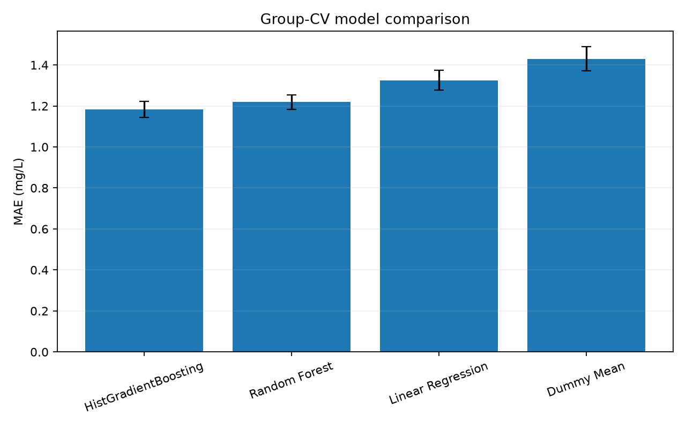
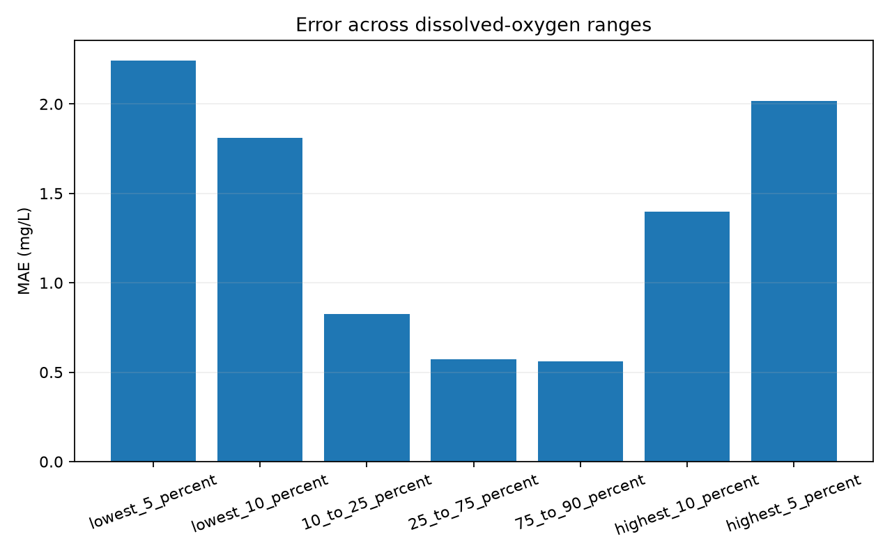

# WaterSense AI

## Abstract

WaterSense AI is an educational machine-learning study asking whether routinely collected physicochemical measurements can estimate contemporaneously measured dissolved oxygen at river-monitoring stations not seen during training. It uses the Northern Ireland Environment Agency’s River Water Quality Monitoring 1990–2024 dataset: 178,680 raw observations from 1,311 stations, of which 151,031 observations from 840 stations were eligible for regression. The workflow preserves censoring qualifiers, uses training-only missing-value preprocessing, and excludes identifiers and location fields from model inputs. Validation is grouped by monitoring station to prevent repeated measurements from the same site appearing on both sides of a split. Five-fold group cross-validation was used for feature and model selection; a separate 168-station holdout remained untouched until final evaluation. The selected Random Forest achieved a holdout MAE of 0.831 mg/L, RMSE of 1.291 mg/L and R² of 0.539, improving MAE by 29.6% over the Phase 3 baseline. Performance was substantially poorer at dissolved-oxygen extremes. The strongest limitation is the absence of water temperature, flow and other physical context, so the model supports methodological exploration rather than forecasting, causal inference, safety assessment or regulatory decisions.

## 1. Introduction

Dissolved oxygen (DO) is a useful environmental measurement because aquatic organisms depend on oxygen dissolved in water and because observed DO varies with physical, chemical and biological conditions. This project does not attempt to convert DO into a safety class or ecological-status decision. Instead, DO provides a continuous, directly measured outcome through which to study the relationship between co-measured river chemistry and a scientifically meaningful target.

Machine learning can help explore multivariable patterns that may be nonlinear or involve interactions. Environmental monitoring data, however, are not simple independent observations. The same stations are sampled repeatedly; measurement coverage changes over time; laboratory reports include values below or above reporting limits; and unusual observations may represent either genuine events or errors. A high score obtained without respecting those features would be less informative than a modest score produced by a credible validation design.

The project therefore asks:

> Can machine-learning models estimate contemporaneously measured dissolved oxygen from physicochemical river-monitoring variables at previously unseen monitoring stations?

The emphasis is methodological credibility. The project tests transfer to held-out stations, preserves data-quality information, compares simple baselines, investigates failure regions, and separates predictive association from causation. It does not predict future river conditions and does not determine whether water is safe.

## 2. Dataset

The dataset is **River Water Quality Monitoring 1990 to 2024 — All Parameters**, published by the Northern Ireland Environment Agency (NIEA), within DAERA, through the [official OpenDataNI/data.gov.uk catalogue](https://www.data.gov.uk/dataset/0840ab33-18ae-4670-8523-ac43105f5902/river-water-quality-monitoring-1990-to-2024-all-parameters) under the UK Open Government Licence.

| Property | Verified value |
|---|---:|
| Raw observations | 178,680 |
| Raw columns | 40 |
| Raw monitoring stations | 1,311 |
| Eligible modelling observations | 151,031 |
| Eligible modelling stations | 840 |
| Observed dates | 1990-01-02 to 2024-12-11 |
| Geographic scope | Northern Ireland rivers |

Government provenance, a long time span and station/date metadata make the dataset suitable for a reproducible study. The data should not be interpreted as a representative sample of all rivers worldwide. They reflect one monitoring program, region, set of methods and history of sampling priorities.

The export contains measurements including biochemical oxygen demand (BOD), ammonia, nitrite, nitrate, soluble reactive phosphorus, pH, alkalinity, conductivity, suspended solids and dissolved oxygen. It also includes identifiers, dates, locations, coordinates and paired qualifier fields.

Several data-quality features shaped the study:

- missingness varies substantially between measurements;
- many laboratory values have `<` or occasional `>` qualifiers;
- monitoring stations have repeated observations and unequal record counts;
- sampling intensity varies across years;
- the source warns that unusually large values may reflect genuine events, contamination, sampling problems or typographical errors; and
- important physical variables, especially water temperature and flow, are absent.

No risk label, safety classification or official ecological-status outcome is present. Dissolved oxygen was therefore retained as an original continuous measurement rather than converted into arbitrary classes.

## 3. Data Preparation

The original CSV remained unchanged. Its SHA-256 checksum was recorded so that the exact inspected export could be identified. Processing produced a separate modelling table.

Rows without a dissolved-oxygen target cannot contribute to supervised regression and were excluded. There were 27,643 such rows. Six additional target observations had a `<` qualifier. Because their exact target values were unknown, they were also excluded rather than treated silently as exact measurements. This left 151,031 eligible observations.

Predictor censoring was handled differently. The exported numeric companion was retained, and explicit below-limit or above-limit indicator features were added. For example, a reported ammonia value associated with `<` remains numerically available while the model also receives a flag showing that it is censored. The project did not replace censored values with half the reported limit because that regulatory convention would be an additional modelling assumption and would not recover the true concentration.

Missing predictor values were handled by median imputation. Crucially, the median was learned only from the training portion inside each fitted pipeline. Missingness indicators were also generated. This avoids using information from validation or test rows when calculating preprocessing values.

The baseline inputs were BOD, ammonia, nitrite, nitrate, soluble reactive phosphorus and pH, together with relevant censor flags. Phase 4 additionally evaluated alkalinity, conductivity, suspended solids and cyclical day-of-year context. Station code was retained only for grouping. Database identifiers, station and location names, coordinates, basin, depth and raw date identifiers were excluded as predictors to reduce memorisation and leakage risk.

Unusual values were not automatically removed. A statistical outlier is not necessarily a verified measurement error, and the available documentation did not identify individual records as erroneous.

## 4. Validation Design

An ordinary random row split would be misleading because multiple rows often come from the same station. If one station appeared in both training and test data, the model could benefit from site-specific patterns rather than demonstrating transfer to a new monitoring location.

`StationCode` was therefore used as the grouping variable. The final Phase 3/4 reference split contains:

- 119,690 training observations from 672 stations;
- 31,341 test observations from 168 different stations; and
- zero station overlap.

Phase 4 kept this final test set sealed. Five-fold `GroupKFold` was applied only inside the training portion. Each fold trained on approximately four-fifths of the training stations and validated on the remaining station group. Preprocessing was refitted independently within every fold.

Training leakage occurs when information unavailable at model-fitting time enters learned preprocessing or model parameters. Validation leakage occurs when the same groups appear in fold training and validation. Test leakage occurs when final-test results guide feature or parameter choices. The pipeline, group structure and experiment sequence were designed to prevent all three. Only after feature-set and model selection had been completed using training-only cross-validation was the selected pipeline evaluated on the final holdout.

*Figure 1. Mean station-grouped cross-validation MAE for the four core-feature candidates; error bars show variation across folds.*

## 5. Baseline Models

Phase 3 compared four deliberately simple regression baselines on the station-grouped holdout.

| Model | MAE (mg/L) | RMSE (mg/L) | R² |
|---|---:|---:|---:|
| Random Forest | 1.181 | 1.644 | 0.253 |
| Linear Regression | 1.282 | 1.767 | 0.136 |
| Dummy Mean | 1.392 | 1.902 | approximately 0 |
| Decision Tree | 1.686 | 2.404 | -0.599 |

The Dummy Regressor predicted the training mean and provided a minimum reference. Linear Regression tested whether a simple additive linear relationship was sufficient. The Decision Tree represented an unrestricted nonlinear model, while the Random Forest averaged many trees to reduce instability.

Random Forest produced the lowest baseline MAE, but R² remained 0.253 and errors were much larger at the target extremes. The Decision Tree performed worse than the dummy, illustrating that greater flexibility does not guarantee better generalisation.

## 6. Model Refinement

Phase 4 introduced robust group-aware cross-validation, feature-set comparison, one additional scikit-learn model and modest parameter refinement. HistGradientBoosting was chosen as the additional model because it can represent nonlinear structure efficiently without adding an external machine-learning dependency.

On the core feature set, five-fold station-grouped CV produced:

| Model | CV MAE mean | CV MAE SD | CV RMSE mean | CV R² mean |
|---|---:|---:|---:|---:|
| HistGradientBoosting | 1.184 | 0.039 | 1.696 | 0.272 |
| Random Forest | 1.219 | 0.036 | 1.732 | 0.240 |
| Linear Regression | 1.325 | 0.049 | 1.883 | 0.102 |
| Dummy Mean | 1.430 | 0.060 | 1.994 | -0.006 |

The parameter search was intentionally small: three Random Forest configurations and four HistGradientBoosting configurations. The goal was to compare scientifically reasonable regularisation and complexity choices, not to maximise performance through a large search. The primary selection rule was lowest mean group-CV MAE. The final test set was not consulted.

## 7. Feature-Set Development

Four feature sets were defined before final model evaluation:

- **A — Core chemistry:** BOD, ammonia, nitrite, nitrate, soluble reactive phosphorus and pH, plus censor flags.
- **B — Extended chemistry:** core features plus alkalinity, conductivity and suspended solids, with additional censor flags where present.
- **C — Core plus temporal context:** core features plus sine and cosine transformations of day of year.
- **D — Extended plus temporal:** the extended chemistry and temporal inputs together.

HistGradientBoosting, the strongest core-feature CV candidate, was used to compare these sets.

| Feature set | Input predictors | CV MAE mean | CV MAE SD |
|---|---:|---:|---:|
| A — Core chemistry | 16 | 1.184 | 0.039 |
| B — Extended chemistry | 23 | 1.132 | 0.032 |
| C — Core plus temporal | 18 | 0.986 | 0.041 |
| D — Extended plus temporal | 25 | 0.931 | 0.037 |

*Figure 2. Station-grouped CV MAE for the four predefined feature sets. Temporal context produced a larger improvement than extended chemistry alone.*

The main observation is that cyclical temporal context added more predictive information than the extended chemistry by itself. This may reflect recurring seasonal structure or other time-linked monitoring conditions, but it does not establish that season causes changes in DO. Date-derived inputs also do not turn the model into a forecasting system: the model still estimates a measurement from the same sampling context.

## 8. Final Model

The selected model was a `RandomForestRegressor` with:

- 150 trees;
- `min_samples_leaf=2`;
- `max_features=0.8`; and
- `random_state=42`.

It used feature set D. Selection was based on training-only group CV:

| Validation | MAE | RMSE | R² |
|---|---:|---:|---:|
| Five-fold training-station CV | 0.880 ± 0.035 | 1.392 | 0.510 |
| Untouched 168-station holdout | 0.831 | 1.291 | 0.539 |

The final MAE was 0.350 mg/L, or 29.6%, lower than the Phase 3 Random Forest on the same test set. This improvement combines feature refinement, temporal context and modest tuning; it cannot be attributed solely to parameter tuning.

*Figure 3. Actual and predicted dissolved oxygen on the untouched station-grouped holdout. The dashed line represents exact agreement.*

## 9. Error Analysis

Overall MAE does not describe performance uniformly across the target distribution. The selected model still regresses predictions toward the middle: low measurements are generally predicted too high, while high measurements are generally predicted too low.

| Target range | Rows | MAE | Directional finding |
|---|---:|---:|---|
| Overall | 31,341 | 0.831 | Mean residual -0.030 mg/L |
| Lowest 10% | 3,308 | 1.812 | 89.964% overpredicted |
| Central 25–75% | 15,130 | 0.572 | Approximately balanced direction |
| Highest 10% | 3,540 | 1.396 | 94.831% underpredicted |

The lowest 5% had MAE 2.243 mg/L and the highest 5% had MAE 2.018 mg/L. These are descriptive quantile ranges, not environmental classifications or regulatory thresholds.

*Figure 4. Holdout MAE across data-derived DO ranges. Error is substantially higher at both extremes than in the central distribution.*

*Figure 5. Mean actual and predicted DO within actual-DO deciles. Departures from the dashed equality line show systematic compression toward average values.*

Station-level performance also varied. Among held-out stations with at least 30 observations, `UKGBNIF10521` had MAE 3.195 mg/L over 202 observations, while several stations showed sustained positive or negative mean residuals. These differences may reflect site conditions, missing context, historical measurements or data quality; the available evidence does not establish a cause.

Seasonal summaries showed the highest MAE in summer at 0.919 mg/L, compared with 0.788 in autumn, 0.789 in winter and 0.825 in spring. This is descriptive model performance, not evidence of a climate or ecological mechanism.

## 10. Explainability

Permutation importance measures how much held-out prediction error increases when one input is randomly disrupted. Unlike tree impurity importance, it is calculated directly against held-out predictive performance.

| Input | Mean MAE increase | SD |
|---|---:|---:|
| Day-of-year cosine | 0.447 | 0.003 |
| pH | 0.322 | 0.004 |
| Day-of-year sine | 0.291 | 0.002 |
| Alkalinity | 0.150 | 0.002 |
| Nitrate | 0.083 | 0.002 |
| Nitrite | 0.080 | 0.001 |
| Conductivity | 0.080 | 0.002 |

*Figure 6. Increase in held-out MAE after permuting each input. Importance describes dependence of the fitted model on available information, not causation.*

Partial-dependence plots were used to visualise selected global model behaviour. They average predictions over the observed sample while varying one input. They should not be read as interventions on a river system.

SHAP was intentionally not added. It would introduce a compatibility-sensitive dependency, while the current global explanation goal was already served by held-out permutation importance and partial dependence. This was an engineering and scientific scope decision rather than an attempt to maximise the number of explanation methods.

## 11. Uncertainty and Error Distribution

Absolute errors from the selected model’s five group-CV validation folds provide an empirical description of validation variability:

| Percentile | Absolute error |
|---|---:|
| 50th | 0.592 mg/L |
| 75th | 1.117 mg/L |
| 90th | 1.908 mg/L |
| 95th | 2.622 mg/L |

These values support statements about the observed validation-error distribution. They are not formal probabilistic prediction intervals, do not provide case-specific coverage guarantees, and should not be presented as confidence bounds around an individual prediction.

## 12. Limitations

The main limitations are substantive rather than cosmetic:

- **Missing physical context:** water temperature, flow and other conditions important to DO are unavailable.
- **Regional scope:** the data cover Northern Ireland rivers and do not establish generalisation elsewhere.
- **Contemporaneous objective:** the model estimates a co-measured outcome and cannot forecast future river conditions.
- **Historical consistency:** the export spans 35 years, but possible changes in monitoring methods or priorities are not fully documented in the CSV.
- **Censoring:** numeric reported limits plus flags preserve information but do not recover unknown true concentrations.
- **Missing data:** median imputation is a reproducible baseline, not reconstruction of the original measurement.
- **Extreme observations:** unusual source values remain unverified and contribute to tail errors.
- **Uneven performance:** the lowest and highest DO observations remain substantially harder to estimate.
- **No causal interpretation:** feature importance and partial dependence describe model behaviour, not environmental mechanisms.
- **No regulatory validation:** the model has not been assessed for operational, safety or ecological-status use.

## 13. Conclusion

The research question can be answered cautiously: yes, the available chemistry and temporal features contain meaningful predictive information for estimating contemporaneously measured dissolved oxygen at previously unseen monitoring stations. Group-aware feature refinement reduced holdout MAE from 1.181 to 0.831 mg/L, and the model explained more variation than the Phase 3 baselines.

However, performance is not uniform. The model continues to overpredict most lowest-decile observations and underpredict most highest-decile observations. Missing water temperature, flow and other physical context restrict both predictive performance and interpretation. WaterSense AI therefore demonstrates a reproducible environmental machine-learning workflow and the importance of leakage-aware validation and error analysis. It does not determine water quality or safety, forecast future conditions, or establish causal relationships.

## Development Note

AI-assisted coding tools were used during implementation and debugging. Project design, dataset selection, modelling decisions, validation strategy, interpretation and documentation were reviewed and directed by the project author.
