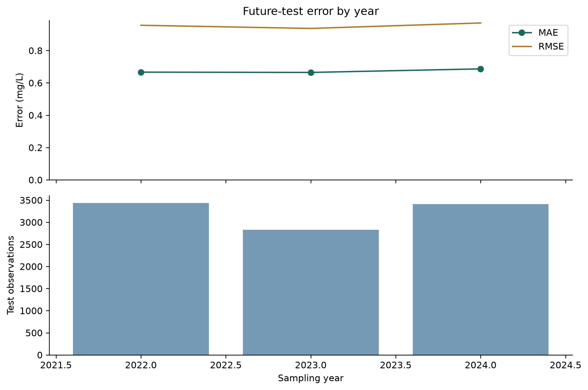
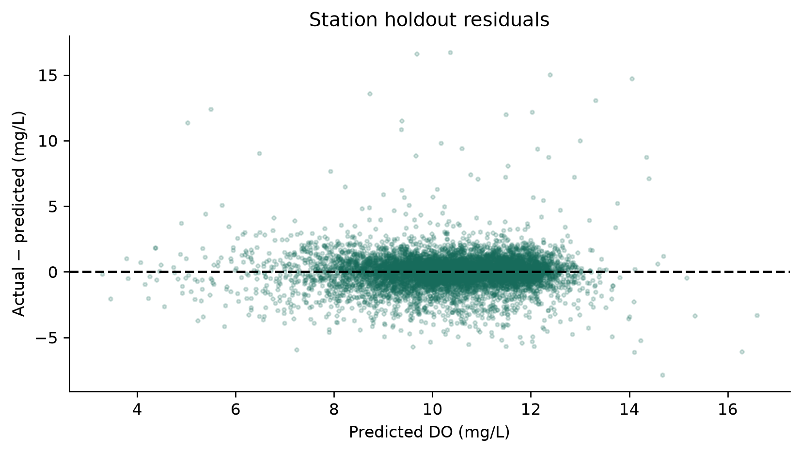
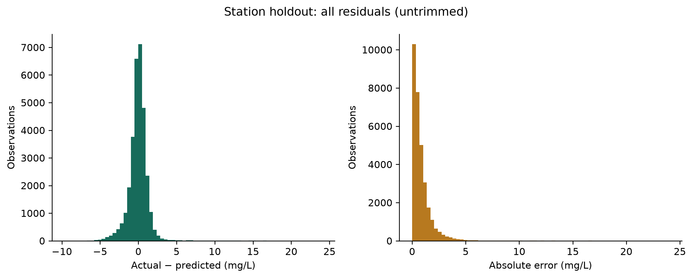
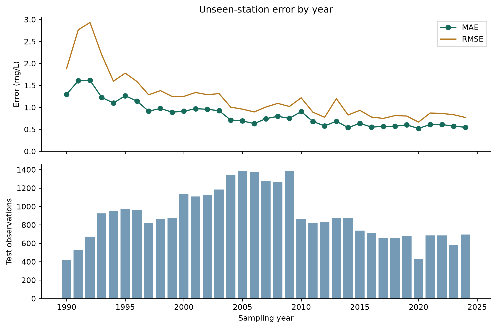
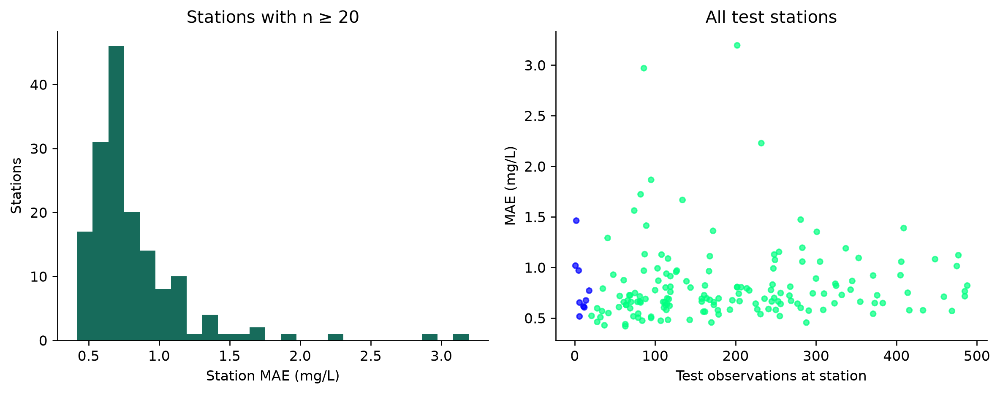
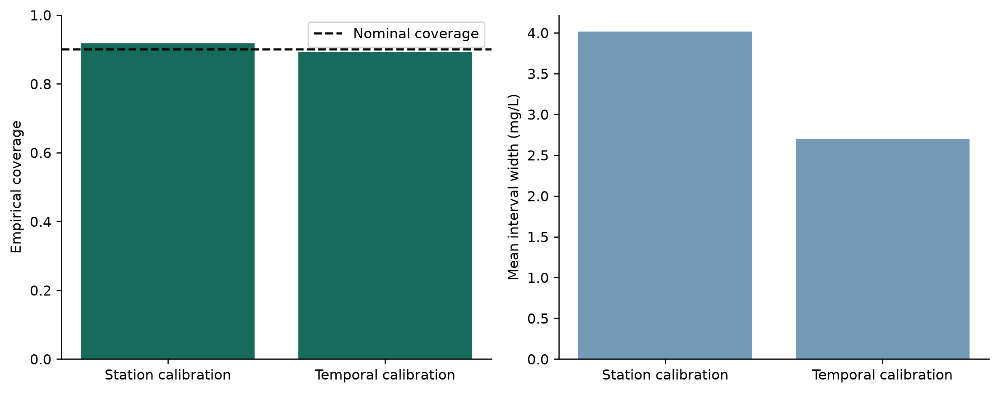
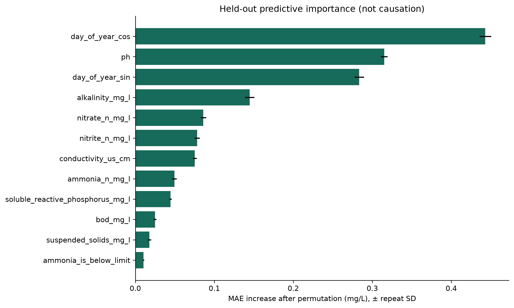
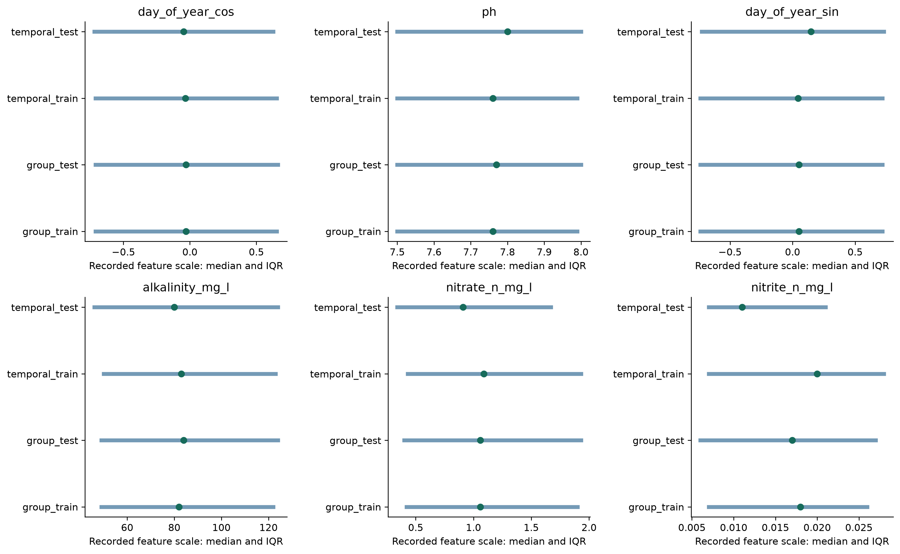

# WaterSense AI

**Evaluating Spatial and Temporal Generalization in Machine-Learning-Based Dissolved Oxygen Prediction**

**Full-data fixed-protocol experiment.**

## Research question

How well can machine-learning models predict dissolved oxygen and generalize across unseen monitoring stations and future time periods? Where does the model fail, even when aggregate metrics appear acceptable?

## Dataset

NIEA/DAERA public river monitoring: 178,680 raw observations, 40 columns, 1,311 original stations; 151,031 eligible observations from 840 stations, 1990-01-02 to 2024-12-11. This run used 151,031 observations.

Target: original measured `DO_mg_l_`, renamed `dissolved_oxygen_mg_l` (mg/L). Rows with missing or qualified targets are excluded by the unchanged cleaning function. No safety labels or ecological thresholds are inferred.

## Methodology and evaluation boundaries

Random Forest: 150 trees, minimum leaf size 2, max_features=0.8, seed=42. All strategies use these fixed settings. Median imputation and scaling are fitted only on the respective training partition. Censor flags pass through unchanged; numeric reporting limits are retained. Station ID, target qualifiers and location metadata are never predictors.

Full inputs: `bod_mg_l`, `ammonia_n_mg_l`, `nitrite_n_mg_l`, `nitrate_n_mg_l`, `soluble_reactive_phosphorus_mg_l`, `ph`, `bod_is_below_limit`, `bod_is_above_limit`, `ammonia_is_below_limit`, `ammonia_is_above_limit`, `nitrite_is_below_limit`, `nitrite_is_above_limit`, `nitrate_is_below_limit`, `nitrate_is_above_limit`, `phosphorus_is_below_limit`, `phosphorus_is_above_limit`, `alkalinity_mg_l`, `conductivity_us_cm`, `suspended_solids_mg_l`, `alkalinity_is_below_limit`, `alkalinity_is_above_limit`, `suspended_solids_is_below_limit`, `suspended_solids_is_above_limit`, `day_of_year_sin`, `day_of_year_cos`.

Random splitting uses 80%/20% rows. Station splitting uses 80%/20% station groups and reproduces the historical Phase 4 holdout. Station grouping measures transfer to unseen locations in this network, not distance-blocked or catchment-disjoint extrapolation. Nearby stations can remain related.

Chronological training ends in 2018; 2019–2021 is reserved for calibration; 2022 onward is the final future test. No shuffling or refitting on calibration rows occurs. Chemistry is still measured in the test year: this evaluates future-period contemporaneous estimation, not a forecast with unknown future inputs.

**Retrospective design limitation:** model parameters and the full feature set were previously selected in Phase 4 using grouped data spanning all years. This study freezes that choice; it does not claim a historically untouched model-selection process for the future years. Grouped holdout results were also already inspected in earlier phases. New test results are descriptive re-evaluations, not a fresh confirmatory external benchmark. No new tuning is performed.

## Validation strategies

| strategy | mae | rmse | r2 | train_rows | test_rows | train_stations | test_stations | station_overlap |
| --- | --- | --- | --- | --- | --- | --- | --- | --- |
| Random rows | 0.8410 | 1.3285 | 0.5363 | 120824 | 30207 | 833 | 813 | 806 |
| Unseen stations | 0.8312 | 1.2911 | 0.5391 | 119690 | 31341 | 672 | 168 | 0 |
| Future years | 0.6730 | 0.9557 | 0.6646 | 132766 | 9676 | 832 | 508 | 500 |
| Spatiotemporal Holdout | 0.6918 | 1.0241 | 0.6429 | 120955 | 1828 | 733 | 101 | 0 |

Grouped minus random MAE: -0.0098 mg/L (-1.17% relative change); R² difference: 0.0028.

This run does not show lower random-split MAE. Random splitting should not automatically be called optimistic when the measured comparison does not support that claim.

Test populations and training sizes differ. These contrasts do not isolate a causal effect of split choice, and one seed does not establish uncertainty across possible partitions.

| partition | feature | rows | missing_fraction | mean | std | median | q25 | q75 | iqr |
| --- | --- | --- | --- | --- | --- | --- | --- | --- | --- |
| train | dissolved_oxygen_mg_l | 132766 | 0.0000 | 10.3330 | 2.0195 | 10.5000 | 9.3000 | 11.5000 | 2.2000 |
| calibration | dissolved_oxygen_mg_l | 8589 | 0.0000 | 10.5585 | 1.5650 | 10.7000 | 9.7000 | 11.6000 | 1.9000 |
| test | dissolved_oxygen_mg_l | 9676 | 0.0000 | 10.2834 | 1.6502 | 10.4000 | 9.5000 | 11.4000 | 1.9000 |

| sample_year | sample_count | mae | rmse | bias |
| --- | --- | --- | --- | --- |
| 2022 | 3433 | 0.6664 | 0.9563 | -0.3130 |
| 2023 | 2831 | 0.6646 | 0.9368 | -0.2844 |
| 2024 | 3412 | 0.6866 | 0.9706 | -0.1325 |

Future-test MAE is 0.6730 mg/L with bias -0.2410 mg/L. 500 of 508 test stations also occur in temporal training. Better future-test performance would not establish robustness everywhere: station composition, target variability and the amount of training data differ from the station-held-out test.

## Spatiotemporal Generalization

This point-prediction experiment evaluates simultaneous shift in monitoring location and time period. Eligibility requires at least one retained observation through 2021 and at least one in the future period. No minimum beyond presence in both periods is imposed: this avoids outcome-driven station filtering, but does not ensure precise individual-station estimates. The station inventory records observation counts, years represented, first/last year, historical/future counts, eligibility reason and selection for every station.

There are 502 eligible continuing stations, 332 historical-only stations and 6 future-only stations. A sorted eligible-station list is partitioned by sklearn train_test_split, seed 42, test fraction 20% (rounded up to 101 stations). All observations from selected stations are excluded from fitting. Historical-only stations are retained on the training side; future-only stations are not eligible for this continuing-station test. The 502 eligible stations are specifically the holdout-selection population, not the complete training population: 401 non-held-out continuing stations plus 332 historical-only stations give 733 training stations.

Training: 120,955 observations / 733 stations, 1990-01-02 to 2021-12-09. Test: 1,828 observations / 101 stations, 2022-01-04 to 2024-12-11. Unused held-out historical rows: 20,400; unused future rows at other stations: 7,848. All four roles are saved in the split-membership artifact; no discarded rows are hidden.

Station overlap is asserted to be zero; max(train date) < min(test date) is asserted. The unchanged 25-feature pipeline fits imputation/scaling only on historical training stations. Fixed hyperparameters are reused, without tuning, model selection, feature selection or calibration on the new test. Uncertainty intervals are intentionally omitted: this point-only fit uses historical data through 2021, whereas the unchanged temporal model trains through 2018 and reserves 2019–2021 for calibration. Thus training horizons/sizes differ; this is not a controlled isolation of spatial shift.

| mae | rmse | r2 | median_absolute_error | p90_absolute_error | p95_absolute_error | train_target_mean | test_target_mean | train_target_median | test_target_median | train_low_do_fraction | test_low_do_fraction |
| --- | --- | --- | --- | --- | --- | --- | --- | --- | --- | --- | --- |
| 0.6918 | 1.0241 | 0.6429 | 0.4947 | 1.3952 | 2.0123 | 10.3311 | 10.3044 | 10.5000 | 10.4000 | 0.0060 | 0.0077 |

Spatiotemporal MAE minus future-year MAE: +0.0188 mg/L; minus unseen-station MAE: -0.1394 mg/L. These measured contrasts describe different test populations, not causal effects of the split.

| strategy | sample_count | mean | median | std | fraction_<4 | fraction_4–<8 | fraction_8–<12 | fraction_≥12 |
| --- | --- | --- | --- | --- | --- | --- | --- | --- |
| Random rows | 30207 | 10.3290 | 10.5000 | 1.9509 | 0.0060 | 0.0906 | 0.7428 | 0.1606 |
| Unseen stations | 31341 | 10.3345 | 10.5000 | 1.9016 | 0.0053 | 0.0860 | 0.7453 | 0.1635 |
| Future years | 9676 | 10.2834 | 10.4000 | 1.6502 | 0.0072 | 0.0645 | 0.7966 | 0.1317 |
| Spatiotemporal Holdout | 1828 | 10.3044 | 10.4000 | 1.7142 | 0.0077 | 0.0706 | 0.7905 | 0.1313 |

The spatiotemporal test has target SD 1.714 mg/L versus 1.902 in the grouped test; 79.05% versus 74.53% lie in the 8–<12 range. This greater concentration in a comparatively low-error range may contribute to lower overall MAE. However, low-DO prevalence is actually higher (0.77% versus 0.53%), so fewer low-DO cases proportionally cannot explain the improvement. These summaries do not isolate the contribution of distribution differences.

Fractions use the same half-open bins: <4, 4–<8, 8–<12 and ≥12 mg/L. These are descriptive ranges, not risk classes. Target mean/median/SD and bin prevalence can help assess population difficulty, but do not fully explain differences in performance.

| do_range | sample_count | mae | rmse | bias | small_sample |
| --- | --- | --- | --- | --- | --- |
| <4 | 14 | 4.7678 | 4.9994 | -4.7678 | True |
| 4–<8 | 129 | 1.7174 | 2.1108 | -1.6587 | False |
| 8–<12 | 1445 | 0.5509 | 0.7178 | -0.2266 | False |
| ≥12 | 240 | 0.7511 | 1.0167 | 0.6600 | False |

Below 4 mg/L, MAE is 4.7678 mg/L across 14 observations; mean actual-minus-predicted bias is -4.7678 mg/L. Negative bias indicates average overprediction. Low aggregate error must not be read as reliable low-oxygen estimation. This small-subgroup finding is a warning signal, not evidence of a universal systematic bias.

Saved spatiotemporal predictions confirm that 14 of 14 observations below 4 mg/L were overpredicted in this test set.

Bins with fewer than 20 observations are flagged as small samples (a descriptive warning, not a statistical precision guarantee). Empty bins have no error estimate.

| feature | train_median | test_median | train_iqr | test_iqr | standardized_mean_difference |
| --- | --- | --- | --- | --- | --- |
| day_of_year_cos | -0.0290 | -0.0140 | 1.3726 | 1.3520 | -0.0034 |
| ph | 7.7600 | 7.7000 | 0.4900 | 0.5000 | -0.0733 |
| day_of_year_sin | 0.0451 | 0.1510 | 1.4567 | 1.4461 | 0.0406 |
| alkalinity_mg_l | 84.0000 | 74.0000 | 75.0000 | 59.0000 | -0.1486 |
| nitrate_n_mg_l | 1.0900 | 0.8850 | 1.5400 | 1.2400 | -0.1488 |
| nitrite_n_mg_l | 0.0190 | 0.0110 | 0.0220 | 0.0120 | -0.2817 |

The six features come from the existing grouped-test importance ranking; they are used only for descriptive shift summaries, not predictor selection. The model still uses all 25 inputs. Standardized mean differences use the existing pooled within-partition SD definition. All original comparison scores and predictions were reused from checksum-verified outputs when this experiment was added standalone; a fresh all-experiment run computes them normally.

**Limitations:** the randomly held-out subset may not represent all unseen stations. Requiring availability in both periods introduces station-selection effects and excludes newly appearing sites. Spatial and temporal shifts are not independent; environmental conditions and sampling schedules may differ across station groups. One holdout is less stable than repeated grouped evaluation, and row-weighted errors emphasize frequently sampled stations. The evidence remains specific to Northern Ireland, with the previously disclosed retrospective model-selection limitation. Repeated spatiotemporal resampling is future work, not an experiment performed here.

Reproduce only the new experiment with `python scripts/run_research_experiments.py --experiment spatiotemporal --output research_runs/spatiotemporal-reproduction`. It verifies and reuses the released baseline outputs and fits only one research model.

## Feature ablation

Core is six measured chemistry variables with median imputation and no missingness/censor flags. Core+indicators adds the ten existing core censor flags and training-learned missingness indicators. Core+date adds two cyclical day-of-year features without indicators. Full adds extended chemistry, all fourteen censor flags, date context and missingness indicators. Full therefore changes multiple components; these four configurations are not a complete factorial experiment.

The same station holdout and 5 grouped training folds are used for every configuration. Input and transformed feature counts are both reported. Fold SD is descriptive variation, not a confidence interval. The best configuration is ranked by training Group-CV MAE, not by final-test MAE.

| feature_set | number_of_features | transformed_features | mae | rmse | r2 | cv_mae_mean | cv_mae_std |
| --- | --- | --- | --- | --- | --- | --- | --- |
| core | 6 | 6 | 1.1670 | 1.6255 | 0.2693 | 1.2097 | 0.0379 |
| core_indicators | 16 | 22 | 1.1578 | 1.6148 | 0.2789 | 1.1969 | 0.0368 |
| core_date | 8 | 8 | 0.8869 | 1.3633 | 0.4861 | 0.9502 | 0.0384 |
| full | 25 | 34 | 0.8312 | 1.2911 | 0.5391 | 0.8798 | 0.0353 |

Lowest Group-CV MAE: **full**, 0.8798 ± 0.0353 mg/L. Small differences should not be treated as established improvements without repeat splits or paired uncertainty estimates.

Compared with core-only Group-CV MAE, indicators reduce MAE by 0.0128 mg/L; cyclical date features reduce it by 0.2595 mg/L. These are descriptive differences under the fixed protocol.

## Error analysis

Residual = actual − predicted; positive bias means underprediction. DO bins (<4, 4–<8, 8–<12, ≥12 mg/L) are descriptive concentration ranges, not safety standards.

| do_range | sample_count | mae | rmse | bias |
| --- | --- | --- | --- | --- |
| <4 | 167 | 3.1387 | 3.5232 | -3.1193 |
| 4–<8 | 2694 | 1.8192 | 2.2066 | -1.6977 |
| 8–<12 | 23357 | 0.6304 | 0.8572 | -0.0610 |
| ≥12 | 5123 | 1.1518 | 1.9704 | 1.0884 |

| sample_count | mae | median_absolute_error | p90_absolute_error | p95_absolute_error | bias |
| --- | --- | --- | --- | --- | --- |
| 31341 | 0.8312 | 0.5654 | 1.7972 | 2.5018 | -0.0301 |

MAE below 4 mg/L is 3.139 mg/L (n=167), compared with 0.630 in the 8–<12 range and 1.152 at ≥12. The low/high biases are -3.119 and 1.088 mg/L respectively. The signs identify overprediction or underprediction without assigning a cause.

Station ranking requires n ≥ 20; all stations remain in the overall evaluation. This is a descriptive minimum, not proof that 20 observations yield a stable estimate. Equal-weight station correlations below are exploratory associations, not explanations. Unusual-feature fraction uses training-only 1st/99th percentile limits among observed measurements. Largest-year fraction measures temporal concentration; recent fraction uses years ≥2019.

| station_code | rank_group | sample_count | mae | rmse | mean_actual | mean_predicted |
| --- | --- | --- | --- | --- | --- | --- |
| UKGBNIF11330 | lowest MAE | 63 | 0.4184 | 0.5100 | 10.8175 | 10.6934 |
| UKGBNIF10571 | lowest MAE | 37 | 0.4283 | 0.5887 | 10.7595 | 10.7182 |
| UKGBNIF11316 | lowest MAE | 63 | 0.4384 | 0.5952 | 10.4873 | 10.3924 |
| UKGBNIF10757 | lowest MAE | 288 | 0.4542 | 0.5962 | 10.9467 | 10.7846 |
| UKGBNIF11289 | lowest MAE | 170 | 0.4556 | 0.6407 | 10.9729 | 10.9390 |
| UKGBNIF11332 | lowest MAE | 28 | 0.4611 | 0.6497 | 11.1321 | 10.9252 |
| UKGBNIF10938 | lowest MAE | 107 | 0.4727 | 0.6426 | 10.9664 | 10.8188 |
| UKGBNIF11211 | lowest MAE | 84 | 0.4735 | 0.5989 | 11.1631 | 11.0894 |
| UKGBNIF10375 | lowest MAE | 143 | 0.4813 | 0.6211 | 11.2790 | 10.9946 |
| UKGBNIF11314 | lowest MAE | 116 | 0.4817 | 0.6623 | 10.9414 | 10.8932 |
| UKGBNIF10542 | highest MAE | 409 | 1.3889 | 2.7425 | 11.2867 | 10.7055 |
| UKGBNIF10132 | highest MAE | 89 | 1.4130 | 1.8094 | 8.4112 | 9.3856 |
| UKGBNIF10546 | highest MAE | 281 | 1.4725 | 2.9583 | 10.4397 | 10.1638 |
| UKGBNIF11449 | highest MAE | 74 | 1.5621 | 1.9552 | 7.5919 | 8.2915 |
| UKGBNIF10398 | highest MAE | 134 | 1.6666 | 2.1374 | 9.0856 | 10.2716 |
| UKGBNIF10050 | highest MAE | 82 | 1.7226 | 2.1047 | 8.8890 | 10.2627 |
| UKGBNIF10098 | highest MAE | 95 | 1.8657 | 2.2089 | 8.1074 | 9.7810 |
| UKGBNIF10575 | highest MAE | 232 | 2.2282 | 3.1290 | 6.2848 | 7.7664 |
| UKGBNIF10543 | highest MAE | 86 | 2.9695 | 4.9583 | 11.2814 | 10.8857 |
| UKGBNIF10521 | highest MAE | 202 | 3.1949 | 4.5089 | 10.8475 | 9.6601 |

| variable | spearman_r_with_mae | eligible_stations |
| --- | --- | --- |
| sample_count | 0.2215 | 159 |
| unusual_feature_fraction | 0.2153 | 159 |
| missing_feature_fraction | -0.0991 | 159 |
| extreme_do_fraction | -0.2495 | 159 |
| recent_fraction | -0.2786 | 159 |
| largest_year_fraction | -0.1231 | 159 |

## Uncertainty and reliability

Absolute residuals on a separate calibration set define radius q at order statistic ceil((n+1) × 0.9). Intervals are prediction ± q without clipping. Station calibration reserves 20% of the training stations and fits a separate model on the remaining stations. Its test stations are the unchanged grouped holdout. Temporal calibration uses 2019–2021 with the pre-2019 model. Neither interval radius uses final-test residuals. Test coverage is evaluated only after calibration.

This is a conformal-style residual baseline. Ordinary marginal coverage guarantees require exchangeability, which repeated measurements and temporal shift can violate. Coverage here is empirical, observation-weighted and not guaranteed for each station or target range. The interval quantifies empirical predictive uncertainty under the available validation distribution. It is not a substitute for direct dissolved-oxygen measurement. See [Angelopoulos & Bates](https://arxiv.org/abs/2107.07511).

| experiment | target_coverage | empirical_coverage | mean_interval_width | radius | calibration_rows | calibration_stations | test_rows | test_stations | point_mae |
| --- | --- | --- | --- | --- | --- | --- | --- | --- | --- |
| Station calibration | 0.9000 | 0.9172 | 4.0166 | 2.0083 | 22855 | 135 | 31341 | 168 | 0.8419 |
| Temporal calibration | 0.9000 | 0.8930 | 2.7018 | 1.3509 | 8589 | 508 | 9676 | 508 | 0.6730 |

| do_range | sample_count | empirical_coverage |
| --- | --- | --- |
| <4 | 167 | 0.2575 |
| 4–<8 | 2694 | 0.5991 |
| 8–<12 | 23357 | 0.9656 |
| ≥12 | 5123 | 0.8854 |

| do_range | sample_count | empirical_coverage |
| --- | --- | --- |
| <4 | 70 | 0.1857 |
| 4–<8 | 624 | 0.4615 |
| 8–<12 | 7708 | 0.9366 |
| ≥12 | 1274 | 0.8799 |

**Station low-DO coverage:** 25.7% among 167 observations below 4 mg/L. Overall coverage must not be interpreted as reliable coverage of low-oxygen cases.

**Temporal low-DO coverage:** 18.6% among 70 observations below 4 mg/L. Overall coverage must not be interpreted as reliable coverage of low-oxygen cases.

These intervals belong to the separately fitted research models. The app retains its original Phase 4 point-estimate artifact, so research radii are not attached to individual app predictions.

## Feature importance and distribution shift

Permutation importance uses 5 repeats on up to 5,000 fixed-seed held-out observations, with the fitted pipeline held fixed. Error bars are repeat SD, not inferential confidence intervals. Correlated predictors can share/substitute importance. Feature importance reflects predictive association, not causal influence.

| feature | mae_increase_mean | mae_increase_std | test_rows | repeats |
| --- | --- | --- | --- | --- |
| day_of_year_cos | 0.4431 | 0.0072 | 5000 | 5 |
| ph | 0.3150 | 0.0043 | 5000 | 5 |
| day_of_year_sin | 0.2835 | 0.0059 | 5000 | 5 |
| alkalinity_mg_l | 0.1447 | 0.0060 | 5000 | 5 |
| nitrate_n_mg_l | 0.0861 | 0.0035 | 5000 | 5 |
| nitrite_n_mg_l | 0.0783 | 0.0032 | 5000 | 5 |
| conductivity_us_cm | 0.0752 | 0.0025 | 5000 | 5 |
| ammonia_n_mg_l | 0.0495 | 0.0029 | 5000 | 5 |
| soluble_reactive_phosphorus_mg_l | 0.0446 | 0.0014 | 5000 | 5 |
| bod_mg_l | 0.0248 | 0.0017 | 5000 | 5 |
| suspended_solids_mg_l | 0.0178 | 0.0021 | 5000 | 5 |
| ammonia_is_below_limit | 0.0103 | 0.0009 | 5000 | 5 |

Six top-ranked inputs are described using median, IQR, mean, SD and missing fraction in both training populations and their respective tests. Standardized mean differences use pooled within-partition SD. These summaries describe shift; they do not establish why errors change. Changing environmental conditions, monitoring practice, station composition and covariate shift are hypotheses to investigate, not demonstrated causes.

| comparison | feature | standardized_mean_difference |
| --- | --- | --- |
| group | day_of_year_cos | 0.0010 |
| temporal | day_of_year_cos | -0.0065 |
| group | ph | 0.0078 |
| temporal | ph | -0.0577 |
| group | day_of_year_sin | 0.0011 |
| temporal | day_of_year_sin | 0.0383 |
| group | alkalinity_mg_l | 0.0074 |
| temporal | alkalinity_mg_l | -0.0146 |
| group | nitrate_n_mg_l | -0.0046 |
| temporal | nitrate_n_mg_l | -0.1729 |
| group | nitrite_n_mg_l | 0.0049 |
| temporal | nitrite_n_mg_l | -0.2483 |

## Research Conclusion

Aggregate MAE ranged from 0.6730 to 0.8410 mg/L across the reported validation settings. The results are broadly comparable in scale, but this is not a statistical equivalence claim. Each split answers a different generalization question; their metrics should not be interpreted as directly interchangeable measures of model quality. The random-versus-grouped comparison above does not justify assuming random-split optimism.

Temporal and spatiotemporal holdouts produced relatively low aggregate errors in these particular test populations. Different target distributions, station composition and training horizons prevent attributing the differences to split design alone or claiming universal robustness. Rare low-oxygen observations remained substantially harder; the small spatiotemporal subgroup is a warning signal rather than definitive evidence of general systematic bias.

The separately calibrated research prediction intervals also had substantially poorer low-DO coverage than aggregate coverage. They describe predictive uncertainty, not measurement confidence intervals, and do not replace field measurement. Together, these findings illustrate why aggregate metrics alone are insufficient for assessing environmental prediction reliability. Understanding where the model fails is at least as important as improving a headline score.

## Limitations

- Prediction does not replace field measurements or laboratory analysis.
- The observational dataset cannot identify causal environmental mechanisms.
- The geographic scope is the Northern Ireland monitoring network; station separation is not catchment separation.
- Distribution shift can degrade performance; validation scores do not guarantee universal performance.
- Water temperature and flow/discharge are absent from the current predictors.
- Sampling is irregular and historical monitoring practices may change over time.
- Interval validity depends on calibration assumptions; overall coverage can conceal extreme-value failures.
- Fixed parameters were selected previously; retrospective comparisons are not independent prospective validation.
- A single random/group split and row-weighted metrics can underrepresent small stations.

## Future work

Investigate rainfall, water temperature, discharge, weather and catchment characteristics through new data linkage; they are not claimed to be current inputs. Evaluate external catchments and geographic distance blocks, repeated grouped splits, time-respecting model selection, group-aware calibration, and distribution-shift detection.

## Reproducibility

Run `python scripts/run_research_experiments.py --experiment all --output research_runs/reproduction` with a new or empty output directory. The manifest records configuration, source/data hashes, versions, split counts and output checksums. Compressed predictions include source row IDs and all split memberships. Original model and Phase 3/4 result hashes are verified unchanged. Partial experiments and smoke runs use separate directories and do not replace this full report.
