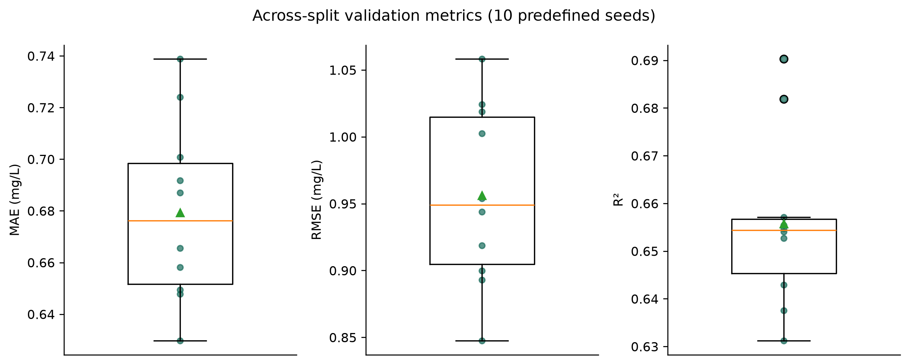
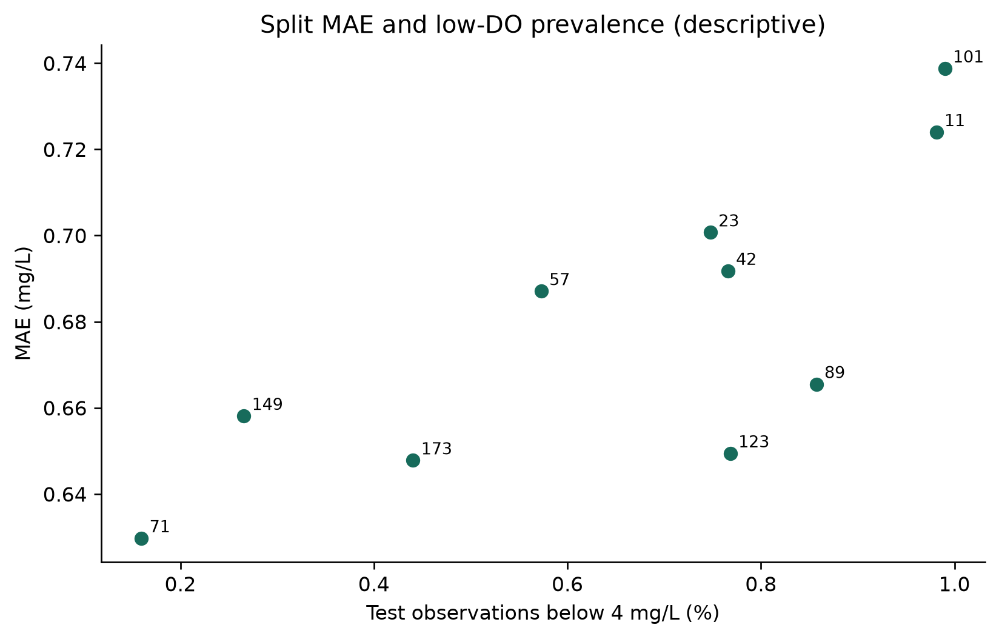
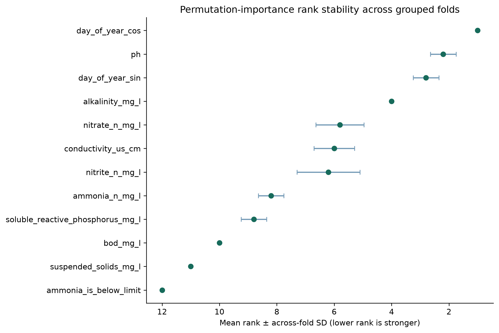

# WaterSense AI — Research Results v2.0

**Scoped robustness analysis; the v1.0 production model and evidence remain unchanged.**

## 1. Purpose of v2.0

v2.0 closes six predefined methodological gaps: repeated spatiotemporal evaluation, one existing-metadata river-basin holdout, grouped-fold permutation-importance stability, a five-configuration reduced ablation, a five-family fixed-model comparison, and empirical residual-interval evaluation across regimes. No test-set tuning, production-model replacement, new targets, external data or new uncertainty method was used.

**Retrospective limitation:** the original model and feature choices were selected retrospectively using earlier grouped experiments spanning the historical dataset. v2.0 is a robustness analysis and does not convert that earlier process into prospective validation.

## 2. v1.0 Baseline

| strategy | mae | rmse | r2 | test_rows | test_stations |
| --- | --- | --- | --- | --- | --- |
| Random rows | 0.8410 | 1.3285 | 0.5363 | 30207 | 813 |
| Unseen stations | 0.8312 | 1.2911 | 0.5391 | 31341 | 168 |
| Future years | 0.6730 | 0.9557 | 0.6646 | 9676 | 508 |
| Spatiotemporal Holdout | 0.6918 | 1.0241 | 0.6429 | 1828 | 101 |

All v1.0 output hashes were verified before and after v2.0; v2 writes only to `research_outputs_v2/`.

## 3. Repeated Spatiotemporal Validation

Exactly 10 station partitions use seeds 11, 23, 42, 57, 71, 89, 101, 123, 149 and 173. Eligibility and the 2021/2022 boundary are unchanged from v1.0. Each model trains on historical rows from non-held-out stations and tests future rows from held-out stations; station overlap is zero and preprocessing is training-only.

| seed | mae | rmse | r2 | median_absolute_error | p90_absolute_error | p95_absolute_error | train_rows | test_rows | train_stations | test_stations | test_target_mean | test_target_median | test_low_do_fraction |
| --- | --- | --- | --- | --- | --- | --- | --- | --- | --- | --- | --- | --- | --- |
| 11 | 0.7240 | 1.0189 | 0.6547 | 0.5652 | 1.4867 | 1.9244 | 119777 | 2140 | 733 | 101 | 10.1000 | 10.3000 | 0.0098 |
| 23 | 0.7007 | 1.0024 | 0.6541 | 0.5033 | 1.5204 | 2.0734 | 119117 | 2006 | 733 | 101 | 10.2051 | 10.4000 | 0.0075 |
| 42 | 0.6918 | 1.0241 | 0.6429 | 0.4947 | 1.3952 | 2.0123 | 120955 | 1828 | 733 | 101 | 10.3044 | 10.4000 | 0.0077 |
| 57 | 0.6871 | 0.9439 | 0.6903 | 0.5215 | 1.4617 | 1.8974 | 119886 | 1920 | 733 | 101 | 10.1790 | 10.4000 | 0.0057 |
| 71 | 0.6297 | 0.8475 | 0.6375 | 0.5074 | 1.2852 | 1.6332 | 119542 | 1878 | 733 | 101 | 10.5023 | 10.6000 | 0.0016 |
| 89 | 0.6655 | 0.9540 | 0.6571 | 0.5094 | 1.3324 | 1.7461 | 118909 | 1983 | 733 | 101 | 10.3176 | 10.5000 | 0.0086 |
| 101 | 0.7388 | 1.0581 | 0.6312 | 0.5259 | 1.5489 | 2.1957 | 118523 | 2121 | 733 | 101 | 10.1997 | 10.4000 | 0.0099 |
| 123 | 0.6494 | 0.9188 | 0.6819 | 0.4833 | 1.3194 | 1.8017 | 119293 | 1822 | 733 | 101 | 10.3557 | 10.5000 | 0.0077 |
| 149 | 0.6581 | 0.8929 | 0.6554 | 0.5166 | 1.3793 | 1.7697 | 120740 | 1882 | 733 | 101 | 10.3018 | 10.4000 | 0.0027 |
| 173 | 0.6478 | 0.8998 | 0.6527 | 0.4955 | 1.3321 | 1.7236 | 119828 | 1816 | 733 | 101 | 10.4287 | 10.5000 | 0.0044 |

| metric | splits | mean | std | median | iqr | minimum | maximum |
| --- | --- | --- | --- | --- | --- | --- | --- |
| mae | 10 | 0.6793 | 0.0353 | 0.6763 | 0.0469 | 0.6297 | 0.7388 |
| rmse | 10 | 0.9560 | 0.0680 | 0.9490 | 0.1102 | 0.8475 | 1.0581 |
| r2 | 10 | 0.6558 | 0.0182 | 0.6544 | 0.0113 | 0.6312 | 0.6903 |
| median_absolute_error | 10 | 0.5123 | 0.0227 | 0.5084 | 0.0228 | 0.4833 | 0.5652 |
| p90_absolute_error | 10 | 1.4061 | 0.0925 | 1.3873 | 0.1483 | 1.2852 | 1.5489 |
| p95_absolute_error | 10 | 1.8778 | 0.1759 | 1.8496 | 0.2382 | 1.6332 | 2.1957 |
| train_rows | 10 | 119657.0000 | 762.7841 | 119659.5000 | 710.5000 | 118523.0000 | 120955.0000 |
| test_rows | 10 | 1939.6000 | 119.4508 | 1901.0000 | 159.7500 | 1816.0000 | 2140.0000 |
| train_stations | 10 | 733.0000 | 0.0000 | 733.0000 | 0.0000 | 733.0000 | 733.0000 |
| test_stations | 10 | 101.0000 | 0.0000 | 101.0000 | 0.0000 | 101.0000 | 101.0000 |
| test_target_mean | 10 | 10.2894 | 0.1218 | 10.3031 | 0.1451 | 10.1000 | 10.5023 |
| test_target_median | 10 | 10.4400 | 0.0843 | 10.4000 | 0.1000 | 10.3000 | 10.6000 |
| test_low_do_fraction | 10 | 0.0065 | 0.0029 | 0.0076 | 0.0036 | 0.0016 | 0.0099 |

MAE across splits: mean 0.6793, SD 0.0353, median 0.6763, IQR 0.0469, range 0.6297–0.7388 mg/L. Seed 42 is 0.6918 mg/L, directly reproducing the v1.0 partition; it was not selected as best.






## 4. Low-DO Reliability

| seed | low_do_n | low_do_mae | low_do_rmse | low_do_mean_residual | low_do_overpredicted_fraction |
| --- | --- | --- | --- | --- | --- |
| 11 | 21 | 4.0188 | 4.2153 | -4.0188 | 1.0000 |
| 23 | 15 | 3.7958 | 4.0225 | -3.7958 | 1.0000 |
| 42 | 14 | 4.7678 | 4.9994 | -4.7678 | 1.0000 |
| 57 | 11 | 2.8846 | 3.3452 | -2.8815 | 0.9091 |
| 71 | 3 | 3.9186 | 4.1267 | -3.9186 | 1.0000 |
| 89 | 17 | 4.1167 | 4.2817 | -4.1167 | 1.0000 |
| 101 | 21 | 4.0562 | 4.3315 | -4.0562 | 1.0000 |
| 123 | 14 | 3.1173 | 3.5073 | -3.1173 | 1.0000 |
| 149 | 5 | 3.8287 | 4.0004 | -3.8287 | 1.0000 |
| 173 | 8 | 4.1115 | 4.2297 | -4.1115 | 1.0000 |

Every split contained low-DO observations (n range 3–21). Split-level low-DO MAE averaged 3.8616 mg/L (SD 0.5300; range 2.8846–4.7678). Overprediction occurred for 9 of 10 splits at 100% of their low-DO observations. Repeated appearances support a persistent warning under these partitions, not a universal bias claim. Split summaries are not pooled as independent observations.

## 5. Spatial / Hydrological Validation

`PrimaryBasin` was present for 834 of 840 modelling stations across 60 consistent basin labels. Six stations lacking a label were excluded only from this experiment. A seed-42 80/20 group split held out entire named basins; both basin and station overlap are zero.

| strategy | mae | rmse | r2 | train_rows | test_rows | train_stations | test_stations | train_basins | test_basins | basin_overlap | station_overlap | excluded_missing_basin_stations | low_do_n | low_do_mae |
| --- | --- | --- | --- | --- | --- | --- | --- | --- | --- | --- | --- | --- | --- | --- |
| PrimaryBasin holdout | 1.0792 | 1.8031 | 0.4122 | 105290 | 44173 | 572 | 262 | 48 | 12 | 0 | 0 | 6 | 620 | 3.4668 |

PrimaryBasin is stricter than station separation but remains an administrative/source field, not proof of hydrological independence; basin size and sample counts are unequal.

## 6. Feature-Importance Stability

Permutation importance uses the existing five station-grouped folds and 10 repeats per fold on up to 5,000 validation rows. Mean within-fold permutation SD describes shuffle randomness; across-fold SD and rank SD describe fold variation. Importance is predictive association, not causation.

| feature | mean_mae_increase | across_fold_mae_increase_sd | mean_within_fold_permutation_sd | mean_rank | rank_sd | top5_fraction | top10_fraction |
| --- | --- | --- | --- | --- | --- | --- | --- |
| day_of_year_cos | 0.4214 | 0.0100 | 0.0079 | 1.0000 | 0.0000 | 1.0000 | 1.0000 |
| ph | 0.2968 | 0.0223 | 0.0075 | 2.2000 | 0.4472 | 1.0000 | 1.0000 |
| day_of_year_sin | 0.2839 | 0.0058 | 0.0079 | 2.8000 | 0.4472 | 1.0000 | 1.0000 |
| alkalinity_mg_l | 0.1398 | 0.0146 | 0.0051 | 4.0000 | 0.0000 | 1.0000 | 1.0000 |
| nitrate_n_mg_l | 0.0787 | 0.0070 | 0.0038 | 5.8000 | 0.8367 | 0.4000 | 1.0000 |
| conductivity_us_cm | 0.0753 | 0.0070 | 0.0034 | 6.0000 | 0.7071 | 0.2000 | 1.0000 |
| nitrite_n_mg_l | 0.0729 | 0.0138 | 0.0044 | 6.2000 | 1.0954 | 0.4000 | 1.0000 |
| ammonia_n_mg_l | 0.0498 | 0.0037 | 0.0030 | 8.2000 | 0.4472 | 0.0000 | 1.0000 |
| soluble_reactive_phosphorus_mg_l | 0.0457 | 0.0051 | 0.0026 | 8.8000 | 0.4472 | 0.0000 | 1.0000 |
| bod_mg_l | 0.0232 | 0.0017 | 0.0021 | 10.0000 | 0.0000 | 0.0000 | 1.0000 |
| suspended_solids_mg_l | 0.0164 | 0.0015 | 0.0014 | 11.0000 | 0.0000 | 0.0000 | 0.0000 |
| ammonia_is_below_limit | 0.0089 | 0.0018 | 0.0013 | 12.0000 | 0.0000 | 0.0000 | 0.0000 |

Mean pairwise Spearman rank correlation across the 10 fold pairs is 0.9486 (range 0.9223–0.9723).



## 7. Reduced Feature Ablation

| feature_set | feature_count | transformed_feature_count | cv_mae_mean | cv_mae_sd | cv_rmse_mean | cv_rmse_sd | cv_r2_mean | cv_r2_sd |
| --- | --- | --- | --- | --- | --- | --- | --- | --- |
| Core | 6 | 6 | 1.2097 | 0.0379 | 1.7218 | 0.0933 | 0.2496 | 0.0280 |
| Core + Date | 8 | 8 | 0.9502 | 0.0384 | 1.4756 | 0.0967 | 0.4492 | 0.0260 |
| Core + Date + Missingness | 8 | 14 | 0.9462 | 0.0393 | 1.4718 | 0.0967 | 0.4521 | 0.0248 |
| Core + Date + Missingness + Censoring | 18 | 24 | 0.9405 | 0.0378 | 1.4646 | 0.0981 | 0.4575 | 0.0265 |
| Full | 25 | 34 | 0.8798 | 0.0353 | 1.3924 | 0.1010 | 0.5097 | 0.0287 |

These five cumulative configurations use identical grouped folds and fixed Random Forest settings. Differences indicate predictive contribution under this design, not causal environmental effects.

## 8. Model-Family Comparison

| model | mae | mae_sd | rmse | r2 | low_do_splits_sufficient_n20 | low_do_n | low_do_mae | regime |
| --- | --- | --- | --- | --- | --- | --- | --- | --- |
| DummyRegressor | 1.4305 | 0.0599 | 1.9939 | -0.0060 | 5 | 758 | 7.6011 | Station-grouped CV |
| Ridge | 1.0375 | 0.0350 | 1.5932 | 0.3576 | 5 | 758 | 4.8292 | Station-grouped CV |
| Random Forest | 0.8798 | 0.0353 | 1.3924 | 0.5097 | 5 | 758 | 3.2652 | Station-grouped CV |
| Extra Trees | 0.8551 | 0.0368 | 1.3526 | 0.5374 | 5 | 758 | 3.4711 | Station-grouped CV |
| HistGradientBoosting | 0.9416 | 0.0379 | 1.4705 | 0.4530 | 5 | 758 | 3.2316 | Station-grouped CV |
| DummyRegressor | 1.2065 | — | 1.6509 | -0.0009 | 1 | 70 | 7.5144 | Temporal holdout |
| DummyRegressor | 1.2241 | — | 1.7140 | -0.0002 | 0 | 14 | 7.9168 | Spatiotemporal seed 42 |
| Ridge | 0.7485 | — | 1.0778 | 0.5734 | 1 | 70 | 4.9057 | Temporal holdout |
| Ridge | 0.7906 | — | 1.1669 | 0.5364 | 0 | 14 | 5.5887 | Spatiotemporal seed 42 |
| Random Forest | 0.6730 | — | 0.9557 | 0.6646 | 1 | 70 | 3.2330 | Temporal holdout |
| Random Forest | 0.6918 | — | 1.0241 | 0.6429 | 0 | 14 | 4.7678 | Spatiotemporal seed 42 |
| Extra Trees | 0.6886 | — | 0.9752 | 0.6508 | 1 | 70 | 3.4812 | Temporal holdout |
| Extra Trees | 0.6939 | — | 1.0320 | 0.6374 | 0 | 14 | 4.7979 | Spatiotemporal seed 42 |
| HistGradientBoosting | 0.6667 | — | 0.9419 | 0.6742 | 1 | 70 | 3.3207 | Temporal holdout |
| HistGradientBoosting | 0.6891 | — | 1.0307 | 0.6383 | 0 | 14 | 5.1122 | Spatiotemporal seed 42 |

DummyRegressor, Ridge, Random Forest, Extra Trees and HistGradientBoosting use fixed settings. The temporal and seed-42 spatiotemporal checks are secondary; no result changes the deployed model. Low-DO MAE is interpreted only where n≥20; the seed-42 low-DO subgroup has n=14 for every model.

## 9. Empirical Uncertainty Across Regimes

The unchanged absolute-residual interval method targets 90% marginal coverage. Station and temporal values below are checksum-verified v1.0 results; repeated spatiotemporal intervals use a separate training-side station calibration split for each seed.

| experiment | nominal_coverage | empirical_coverage | mean_interval_width | radius | calibration_rows | calibration_stations | test_rows | test_stations | point_mae |
| --- | --- | --- | --- | --- | --- | --- | --- | --- | --- |
| Station calibration | 0.9000 | 0.9172 | 4.0166 | 2.0083 | 22855 | 135 | 31341 | 168 | 0.8419 |
| Temporal calibration | 0.9000 | 0.8930 | 2.7018 | 1.3509 | 8589 | 508 | 9676 | 508 | 0.6730 |

| regime | do_range | sample_count | empirical_coverage |
| --- | --- | --- | --- |
| Station calibration | <4 | 167 | 0.2575 |
| Station calibration | 4–<8 | 2694 | 0.5991 |
| Station calibration | 8–<12 | 23357 | 0.9656 |
| Station calibration | ≥12 | 5123 | 0.8854 |
| Temporal calibration | <4 | 70 | 0.1857 |
| Temporal calibration | 4–<8 | 624 | 0.4615 |
| Temporal calibration | 8–<12 | 7708 | 0.9366 |
| Temporal calibration | ≥12 | 1274 | 0.8799 |

| regime | seed | nominal_coverage | empirical_coverage | mean_interval_width | radius | proper_train_rows | calibration_rows | test_rows | point_mae |
| --- | --- | --- | --- | --- | --- | --- | --- | --- | --- |
| Repeated spatiotemporal | 11 | 0.9000 | 0.9453 | 3.7725 | 1.8862 | 94639 | 25138 | 2140 | 0.7234 |
| Repeated spatiotemporal | 23 | 0.9000 | 0.9402 | 3.7400 | 1.8700 | 96800 | 22317 | 2006 | 0.6986 |
| Repeated spatiotemporal | 42 | 0.9000 | 0.9530 | 3.9915 | 1.9957 | 96195 | 24760 | 1828 | 0.6948 |
| Repeated spatiotemporal | 57 | 0.9000 | 0.9510 | 3.9199 | 1.9600 | 96942 | 22944 | 1920 | 0.6894 |
| Repeated spatiotemporal | 71 | 0.9000 | 0.9686 | 3.7095 | 1.8547 | 96992 | 22550 | 1878 | 0.6252 |
| Repeated spatiotemporal | 89 | 0.9000 | 0.9592 | 3.9754 | 1.9877 | 94633 | 24276 | 1983 | 0.6614 |
| Repeated spatiotemporal | 101 | 0.9000 | 0.9326 | 3.9690 | 1.9845 | 94382 | 24141 | 2121 | 0.7534 |
| Repeated spatiotemporal | 123 | 0.9000 | 0.9440 | 3.4813 | 1.7407 | 97850 | 21443 | 1822 | 0.6457 |
| Repeated spatiotemporal | 149 | 0.9000 | 0.9580 | 3.7019 | 1.8510 | 94815 | 25925 | 1882 | 0.6600 |
| Repeated spatiotemporal | 173 | 0.9000 | 0.9615 | 3.8410 | 1.9205 | 95750 | 24078 | 1816 | 0.6545 |

| do_range | splits | mean_sample_count | min_sample_count | max_sample_count | mean_coverage | sd_coverage | median_coverage | min_coverage | max_coverage |
| --- | --- | --- | --- | --- | --- | --- | --- | --- | --- |
| <4 | 10 | 12.9000 | 3 | 21 | 0.0827 | 0.0974 | 0.0627 | 0.0000 | 0.2727 |
| 4–<8 | 10 | 127.0000 | 71 | 173 | 0.6210 | 0.0536 | 0.6269 | 0.5325 | 0.6777 |
| 8–<12 | 10 | 1550.4000 | 1445 | 1712 | 0.9836 | 0.0034 | 0.9849 | 0.9765 | 0.9874 |
| ≥12 | 10 | 249.3000 | 219 | 279 | 0.9610 | 0.0167 | 0.9620 | 0.9412 | 0.9963 |

Repeated-spatiotemporal empirical coverage averaged 95.13% with mean width 3.810 mg/L. These are empirical residual intervals, not conformal guarantees. Repeated measurements and spatial/temporal shift may violate exchangeability.

## 10. Distribution Shift

The existing six top features use the same pooled-SD standardized mean difference and median/IQR summaries across all 10 train/test pairs. No new shift framework or statistical test was introduced.

| feature | mean_smd | sd_smd | median_smd | min_smd | max_smd |
| --- | --- | --- | --- | --- | --- |
| day_of_year_cos | -0.0103 | 0.0039 | -0.0103 | -0.0159 | -0.0034 |
| ph | -0.0425 | 0.0737 | -0.0445 | -0.1873 | 0.0714 |
| day_of_year_sin | 0.0419 | 0.0075 | 0.0416 | 0.0302 | 0.0534 |
| alkalinity_mg_l | -0.0152 | 0.0858 | 0.0023 | -0.1750 | 0.0857 |
| nitrate_n_mg_l | -0.1689 | 0.0769 | -0.1519 | -0.3155 | -0.0925 |
| nitrite_n_mg_l | -0.2644 | 0.0729 | -0.2707 | -0.4245 | -0.1808 |

| relationship | spearman_r |
| --- | --- |
| mean absolute SMD vs MAE | -0.1273 |
| low-DO prevalence vs MAE | 0.7333 |

These 10-point Spearman associations are descriptive only. Shift and low-DO prevalence do not establish causes of split-level error.

## 11. Remaining Limitations

- v2.0 is retrospective robustness analysis, not prospective validation.
- Repeated partitions reuse observations; the 10 scores are not independent external tests.
- Continuing-station eligibility excludes newly appearing future stations and can create selection effects.
- PrimaryBasin grouping is not proof of geographic distance or hydrological independence.
- Six stations lack basin labels; basin groups and station sampling are unequal.
- Low-DO observations remain sparse in individual splits, and metrics are observation-weighted.
- Feature importance can vary with correlated predictors and does not identify causes.
- Water temperature, flow and catchment characteristics are absent from model inputs.
- Empirical interval coverage is distribution-dependent and lacks finite-sample guarantees under shift.
- Evidence remains specific to Northern Ireland and does not replace direct measurement.

## 12. Conclusion

Repeated spatiotemporal MAE varied from 0.6297 to 0.7388 mg/L, replacing reliance on one favorable or unfavorable partition. The nonlinear tree/boosting families and reduced ablation clarify which conclusions persist under fixed alternatives, while importance ranks show measurable fold variation. Low-DO point errors and interval coverage remain the central reliability weakness. Aggregate metrics do not establish uniform reliability.

## 13. Reproducibility

From the repository root, run:

```bash
python scripts/run_research_v2.py --output research_outputs_v2
python -m unittest discover -s tests -v
```

The v2 manifest records the commit, source/data/v1 hashes, package versions, exact seeds, settings and output hashes. The runner refuses a non-empty destination.
